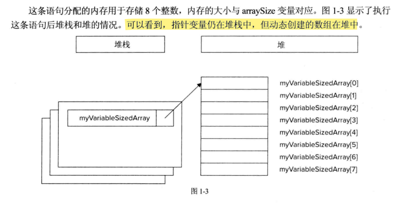
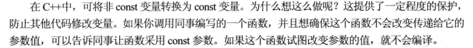

# 输入/输出流
## 转义字符
- \r 回车
- \n 换行
- \t 制表符
- \\ 反斜杠字符
- \" 引号


## 类型
### 枚举类型


## 关键字auto p41

关键字`auto`有4种完全不同的含义：
- 告诉编译器，在编译时自动推断变量的类型
- 替代函数语法
- 函数返回类型的推断
- 通用的lambda表达式


## 关键字decltype

关键字`decltype`把表达式作为实参，计算出该表达式的类型：
```C++
int x = 123;
decltype(x) y = 256;
```


## 指针和动态内存

动态内存允许所创建的程序具有在编译时大小可变的数据，大多数复杂程序都会以某种方式使用动态内存。

### 堆栈和堆

C++程序中的内存分为两个部分——堆栈和堆。

堆栈相当于一副扑克牌，当前顶部的牌代表程序当前的作用域，通常是当前正在执行的函数，为函数提供了独立的内存空间，并且函数执行完毕后，堆栈帧会消失，函数中声明的所有变量都不会再占用内存，变量会被自动释放内存。

堆是与当前函数或堆栈帧完全没有关系的内存区域。如果想在函数调用结束前仍然保留声明的变量，可以将变量放到堆中。

使用指针完成堆上内存分配和释放内存
```C++
int *myIntegerPointer = nullptr;
//使用new操作符分配内存
//指针指向一个整数值的地址
myIntegerPointer = new int;
//给堆中新分配的整数赋值
*myIntegerPointer = 8;

//完成都太分配的内存后，释放内存
delete myIntegerPointer;
myIntegerPointer = nullptr;
```

指针 并非总是指向堆内存，可以声明一个指向堆栈中变量甚至指向其他指针的指针；为了让指针指向某个变量，需要使用&取址运算符：
```C++
int i = 8;
int* myIntegerPointer = &i;
```

>如果指针指向某个结构，可以首先用`*`对指针解除引用，然后使用`.`语法访问结构中的字段：

```C++
Employee* anEmployee = getEmployee();
cout << (*anEmployee).salary << endl;
//这样等效
cout << anEmployee->salary << endl;
```

### 动态分配数组

```C++
int arraySize = 8;
int* myVariableSizedArray = new int[arraySize];

//释放内存
delete[] myVariableSizedArray;

```



>每次调用`new`时，都必须相应地调用`delete`,以免内存泄漏。


>Null不是指针，等价于整数0;nullptr才是空指针常量。

### 智能指针

为了避免内存问题，常用智能指针替代C样式的"裸"指针；智能指针对象在超出作用域时，如函数执行完毕后，会自动释放内存。
>它们都在<memory>头文件中定义
- std::unique_ptr
- std:shared_ptr
- std::weak_ptr

## const的多种用法

- const定义常量

如此，编译器可以保证代码不会改变这个值

- 使用const保护参数



- const引用

const引用参数的主要价值在于效率。当传递引用时，实际上只是传递了一个指向原始数据的指针，这样计算机就不需要制作副本，通过传递const引用，可以不需要副本且原始变量也不会修改。

```C++
void printString(const std::string& myString){
    cout << myString << endl;
}

int main(){
    string someString = "Hello world";
    printString(someString);
    return 0;
}
```


