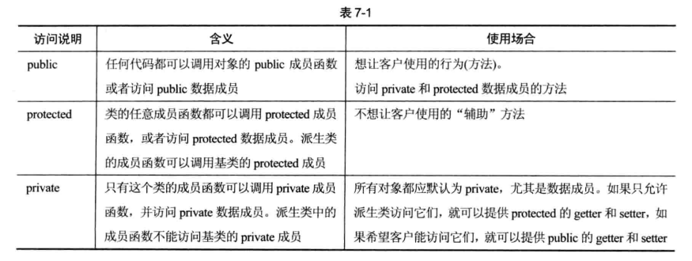

# 类

> 类可以有许多成员，可以是成员函数(方法、构造函数和析构函数)，也可以是成员变量。

> 最好将不改变对象的成员函数声明为const

>访问控制：类中的每个方法和成员都可以使用三种访问说明符来说明:public | protected | private.三者的没有明确的说明顺序。

> C++中结构struct也是这样的搭配风格，区别是:结构的默认访问说明符是Public，而类的默认说明是private;

```C++
//声明类
class SpreadsheetCell
{
        void a();
    public:
        double b() const;
    private:
        double value;
};

//声明结构
struct SpreadsheetCell{
        double b() const;
        void a();
    private:
        double values;
}
```




## 定义方法

与编写独立函数的原型和定义类似，必须编写方法的原型和定义，并且类定义必须在方法定义之前。

>通常类定义在头文件中，方法定义在包含头文件的源文件中。

> 类的非静态方法，总是在类的特定对象上执行。


### this指针

每个普通的方法调用都会传递一个指向那个对象的指针，这就是隐藏参数`this`。这个指针可以访问数据成员、调用方法，也可以将其传递给其他方法或函数。

>有时还用它来消除名称的歧义。


### 使用对象

#### 堆栈中的对象
```C++
SpreadsheetCell myCell,anotherCell;
myCell.setValue(6);
anotherCell.setString("3.2");
cout << myCell.getValue() << endl;
cout << anotherCell.getValue() << endl;
```

#### 堆中的对象

使用`new`动态分配对象

```C++
SpreadsheetCell* myCellp = new SpreadsheetCell();    //调用默认构造函数

myCellp->setValue(3.7);
cout << myCellp->getValue()<< endl;
delete myCellp; //new与delete配套使用
myCellp = nullptr;  //将指针指定为空
```


### 对象的声明周期

对象的声明周期涉及3个活动：创建、销毁和赋值。

在声明变量的时候，最好给变量一个初始值。同样，也应该在初始化对象的时候编写一个构造函数的方法，来执行对象的初始化任务。

>无论什么时候创建对象，都会执行一个构造函数。

>从语法上来讲，构造函数是与类同名的一个方法，构造函数没有返回类型，可以有可无的参数，没有参数的构造函数就称为默认构造函数。

在堆栈中使用构造函数的唯一正确方法：
```C++
SpreadsheetCell myCell(5);
```

在堆中使用构造函数
```C++
auto smartCellp = make_unique<SpreadsheetCell>(4);

SpreadsheetCell* myCellp = new SpreadsheetCell(5);
//向声明一个指向SpreadsheetCell的空指针，然后再调用构造函数
SpreadsheetCell* anotherCellp = nullptr;
anotherCellp = new SpreadsheetCell(4);

delete myCellp;
delete anotherCellp;
```


### 提供多个构造函数


### 默认构造函数

默认构造函数没有参数，称为零参数构造函数，


> 如果想创建某个类的对象数组，最好还是定义类的默认构造函数。(如果实在没有，编译器会自动创建一个默认构造函数)。

在堆栈中使用默认构造函数：

```C++
SpreadsheetCell mycell;
myCell.setValue(6);
cout << myCell.getValue() << endl;
```

在堆中使用默认构造函数
```C++
auto smartCellp = make_unique<SpreadsheetCell>();

SpreadsheetCell* myCellp = new SpreadsheetCell();

//SpreadsheetCell* myCellp = new SpreadsheetCell;

delete myCellp;
myCellp = nullptr;
```


C++现在支持显式默认构造函数：
```C++
class Myclass{
        public:
            Myclass() = default;
            //显式删除构造函数
            Myclass() = delete;
            Myclass(int i);
};
```

### 构造函数初始化器  P156

```C++
//除了在构造函数体内初始化数据成员：
SpreadsheetCell::SpreadsheetCell(){
    mValue = 0;
}

//C++提供了一种在构造函数内初始化数据成员的方法：构造函数初始化器(ctor-initializer)

SpreadsheetCell::SpreadsheetCell() : mValue(0)
{

}
```

#### 6 复制构造函数(真的是看不懂啊)

C++中有一种特殊的构造函数，叫复制构造函数，允许所创建的对象是另一个对象的精确副本。


#### 7 初始化列表构造函数  


#### 8 类内成员初始化器

#### 9 委托构造函数

委托构造函数允许构造函数调用同一个类的其他构造函数。

#### 10 编译器生成的构造函数总结

## 复制和赋值的区别


