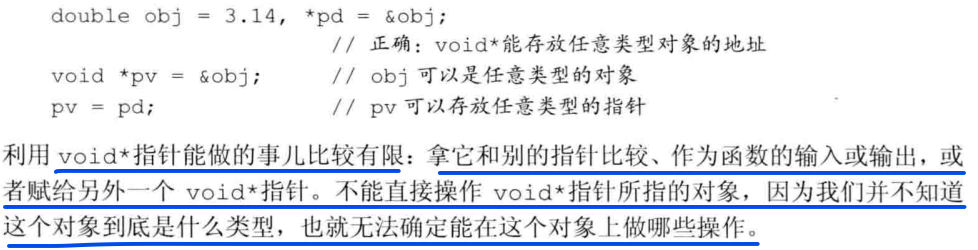
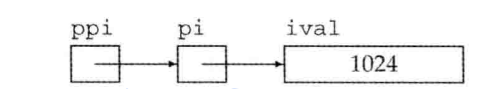

# 变量
> 变量提供了一个具名的、可供程序操作的存储空间。
>
>C++中的每个变量都有其数据类型，数据类型决定着变量所占内存空间的大小和布局方式。
>
## 变量的定义
### 基本形式
>类型说明符(type specifier) + 一个或多个变量名组成的列表。
```C++
int sum = 0,value,units_sold = 0;
Sales_item item;    //item的类型是Sales_item

std::string book("0-2024");
```
#### :closed_book: 何为对象

对象(object)通常指的一块能存储数据并具有某种类型的内存空间。

#### :blue_book:初始值

当对象在创建时获得的一个特定值，就说这个对象被初始化(initialized)了

```C++
double price = 109.99,discount = price * 0.16
```
#### :blue_book:列表初始化

#### :blue_book:默认初始化

如果定义变量时没有指定初值，则变量被默认初始化(default initialized),此时变量被赋予了"默认值"

#### :orange_book:变量声明和定义的关系

为了支持分离式编译，C++语言将声明和定义区分开来。
- **声明**(declaration)使得名字为程序所知，一个文件如果想使用别处定义的名字就必须包含对这个名字的声明。
- 定义(definition)负责创建与名字关联的实体。
```C++
extern int i;       //声明i而非定义i
int j;              //声明并定义j
```

#### :orange_book:标识符

标识符(identifier)由字母、数字和下划线组成，必须以字母或下划线开头。标识符的长度没有限制，但是对大小写字母敏感。


### :notebook: 复合类型
复合类型(compound type)是指基于其他类型定义的类型，主要由引用和指针。

#### :orange_book:引用
引用(reference)为对象起另外一个名字，通过将声明符写成&d的形式来定义引用类型，其中d是声明的变量名：
```C++
int ival = 1024;
int &refVal = ival; //refVal指向ival(是ival的另一个名字)
int &refVal2;       //报错；引用必须被初始化

```
> Note:引用并非对象，相反的，它只是为一个已经存在的对象所起的另一个名字。
>
>Note:引用类型的初始值必须是一个对象。

#### :orange_book:指针

指针(pointer)是指向另外一种类型的复合类型，与引用相似，指针也实现了对其他对象的简洁访问。
- 指针本身就是一个对象，允许对指针赋值和拷贝，而且在指针的声明周期内，它可以先后指向几个不同的对象。
- 指针无需在定义时赋初值。

定义指针类型的方法将声明符写成`*d`的形式：
`int *ip1,*ip2;`

获取对象的地址
>指针存放某个对象的地址，要想获得地址，需要使用取地址符(操作符&)
```C++
int ival = 42;
int *p = &ival;     //p存放变量ival的地址，或者说p是指向变量ival的指针
```

空指针
> 空指针不指向任何对象，以下列出几个生成空指针的方法：
```C++
int *p1 = nullptr;
int *p2 = 0;

//#include cstdlib
int *p3 = NULL;
```

赋值和指针
> 有时候要想搞清楚一条赋值语句到底是改变了只针对额值还是指针所指对象的值，只需要记住：赋值永远改变的是等号左侧的对象，即
```C++
pi = &ival;     //pi的值被改变，现在pi指向了ival
//pi赋一个新值，也就是改变了那个存放在pi内的地址值
*pi = 0;    //ival的值被改变，指针pi并没有改变
//只是指针pi指向的对象发生了改变
```

指针的布尔效应
>空指针在判断条件时，等同于false。

#### :blue_book: void*指针
void*指针是一种特殊的指针类型，可用于存放任意对象的地址。


#### :blue_book: 理解复合类型的声明
>很多程序员容易迷惑于基本数据类型和类型修饰符的关系，其实后者不过是声明符的一部分罢了。

#### :punch: 定义多个变量
>一种错误的观点：在定义语句中，类型修饰符(*或&)作用于本次定义的全部变量：

`int* p;    //合法但容易产生误导`

产生误导的原因是因为：`int*`放在一起好像是这条语句中所有变量共同的类型一样。实际上，基本数据类型仍然是`int`而非`int*`。`*`仅仅是修饰了`p`而已，对其他变量，并不产生任何作用。

`int* p1,p2         //p1是指向int的指针，p2是int`

#### :punch: 指向指针的指针
P52

```C++
int ival = 1024;
int *pi = &ival;        //pi指向一个int型的数
int **ppi = &pi         //ppi指向一个int型的指针
```
`pi`是指向`int`型数的指针，而`ppi`是指向`int`型指针的指针



为了解出原始值，采用三种方式：

```C++
cout << "The value of ival\n"
     << "direct value :" << ival << "\n"  //直接输出
     << "indirect value :" << *pi << "\n"   //通过int型指针pi输出
     << "doubly indirect value : " << **ppi << endl;    //两次解引用ppi，取得ival的值。
```
#### :punch: 指向指针的引用
# P78 有点蒙昂
>引用本身不是一个对象，因此不能定义指向引用的指针
>
>但是指针是对象，所以存在对指针的引用。


## :hammer: const限定符
希望定义这样一种变量，它的值不能被改变。

可以用关键字**const**对变量的类型加以限定：

> 任何试图向常量赋值的行为都将引发错误。因为const对象一旦创建后其值就不能再该比阿尼，所以const对象必须初始化。

`const int buffsize = 512;`


### :punch: const的引用

把引用绑定到const对象上，就像绑定到其他对象上一样，我们称之为对常量的引用(reference to const)

### :punch: 初始化和对const的引用 xx

### :closed_book: 指针和const

与引用一样，也可以令指针指向常量或非常量(pointer to const)，不能用于改变其所指对象的值。

要想存放常量对象的地址，只能使用指向常量的指针。

```C++
const double pi = 3.14;     //pi是个常量，它的值不能改变
double *ptr = &pi;      //错误：ptr是一个普通指针
const double *cptr = &pi;   //正确：cptr可以指向一个双精度常量
*cptr = 42;         //错误：不能给*cptr赋值
```
### :closed_book: const指针

指针是对象而引用不是，因此就像其他对象类型一样，允许把指针本身定为常量。

常量指针(const pointer)必须初始化，而且一旦初始化完成，则它的值(也就是存放在指针中的那个地址)就不能再改变了。

把`*`放在`const`关键字之前泳衣说明指针是一个产量，这样的书写形式就蕴含着一层一维，即`不变的是指针本身的值而非指向的那个值`

```C++
int errNumb = 0;
int *const curErr = &errNumb;   //curErr将一直指向errNumb
const double pi = 3.14;
const double *const pip = &pi;
```

### :closed_book: 顶层const

如前所述，指针本身是一个对象，它又可以只想另外一个对象。

因此，指针本身是不是常量以及指针所指的是不是一个常量就是两个独立的问题。

用名词***顶层const***表示指针本身是个常量，而用名词***底层const***表示指针所指的对象是一个常量。

### :blue_book: constexpr和常量表达式

常量表达式(const expression)是指不会改变并且在编译过程中就能得到计算结果的表达式。


### :floppy_disk: 处理类型

#### :volcano:类型别名

类型别名(type alias)是一个名字，它是某种类型的同义词。

使用类型别名，让复杂的类型名字变得简单明了、易于理解和使用，有助于程序员清楚地知道使用该类型的目的。

传统的方法是使用关键字**typedef**
```C++
typedef double wages;   //wages是double的同义词
typedef wages base, *p;     //base是double的同义词，p是doule*的同义词。
```

还可以通过使用**别名声明**(alias declaration)来定义类型的别名：

`using SI = Sales_item      //SI是Sales_item的同义词`


#### :closed_book: 指针、常量和类型别名


#### :closed_book: auto类型说明符


#### :closed_book: 复合类型、常量和auto

### :blue_book: decltype类型指示符

希望从表达式的类型推断出要定义的变量的类型，但是不想用该表达式的值初始化变量。因此，引入**decltype**,它的作用，是选择并返回操作数的数据类型：

`decltype(f()) sum = x;     //sum的类型就是函数f的返回类型`


### :volcano: 自定义数据结构


### :triangular_ruler: 术语
# P95

