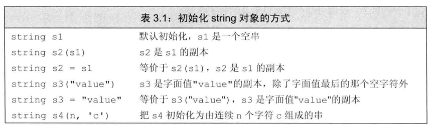
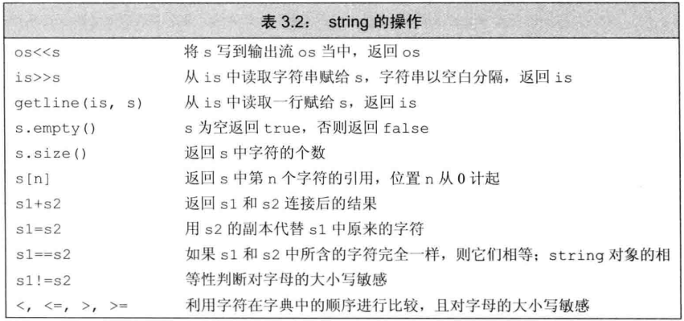
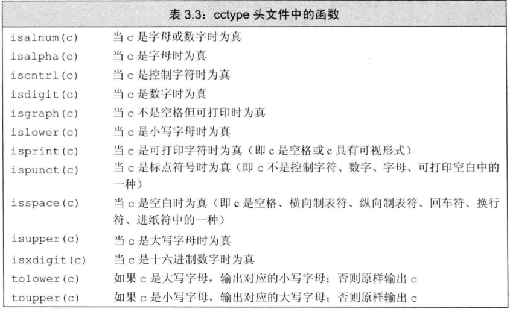

# :black_nib: 标准库类型string

标准库类型**string**表示可变长的字符序列，使用string类型必须首先包含string头文件

```C++
#include <string>
using std::string;
```

## :pencil2:初始化和定义string对象


### :orange_book: 直接初始化和拷贝初始化

如果使用等号`=`初始化一个变量，实际上执行的是拷贝初始化。与之相反，则执行的是直接初始化。

```C++
string s5 = "djw"       //拷贝初始化
string s6("djw")        //直接初始化
string s7(10,'c')       //直接初始化，s7的内容是cccccccccc
```
### :orange_book: string对象上的操作


### :orange_book:使用getline读取一整行

当我们希望能在最终得到的字符串中保留输入的空白符，这时应该用`getline`。

> getline(cin,string对象)

### :orange_book: string的empty和size操作

`empty`函数根据`string`对象是否为空返回布尔值：

`line.empty()`

`size`函数返回`string`对象的长度(即string对象中的字符个数)

### :orange_book: 比较string对象
***

### :orange_book: 为string对象赋值

对于string类而言，允许把一个对象的值赋给另外一个对象
```C++
string st1(10,'c'),st2;
st1 = st2;
```
### :orange_book: 两个string对象相加
```C++
string s1 = "hello",s2 = "world\n"
string s3 = s1 + s2;
s1 += s2;
```

### :orange_book: 字面值和string对象相加

***

## :pencil2:处理string对象中的字符

在`cctype`头文件中定义了一组标准库函数处理这部分工作



### :orange_book: 处理每个字符？使用基于范围的for语句

如果想对string对象中的每个字符做点什么操作的话，可以尝试范围for语句(range for),这种语句遍历给定序列中的每个元素，并对序列中的每个值执行某种操作，其语法形式为：

```C++
for (declaration : expression)
    statement
```
`expression`部分是一个对象，用于表示一个序列。`declaration`部分负责定义一个变量，该变量将被用于访问序列中的基础元素。每次迭代，`declaration`部分的变量会被初始化为`expression`部分的下一个元素值。

也就是说，string对象可以作为`expression`部分：
```C++
string str("some thing");
//每行输出str中的一个字符
for (auto c : str)      //对于str中的每个字符
    cout << c << endl;  //输出当前字符，后面紧跟一个换行符
```
### :orange_book: 只处理一部分字符？

要想访问string对象中的单个字符，两种方式：使用下标、迭代器。

使用下标
```C++
string s("some string");
if(!s.empty())
    s[0] = toupper(s[0])
```

### :orange_book: 使用下标进行迭代

```C++
//把s的第一个词改成大写形式
for (decltype(s.size()) index = 0; index != s.size() && !isspace(s[index]); ++index)
s[index] = toupper(s[index]);
```
### :closed_book: 使用下标进行随机访问


