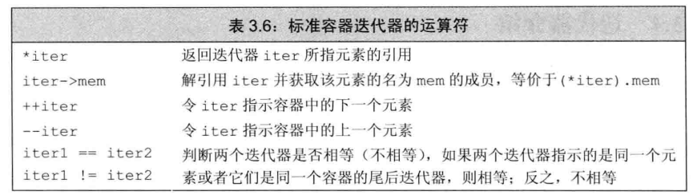

# :sunny:迭代器
## :cloud:使用迭代器

```C++
//b表示v的第一个元素，e表示v尾元素的下一位置
auto b = v.begin(),e = v.end();
```

### :orange_book: 迭代器运算符



```C++
//把string对象的第一个字母改为大写形式
string s("some thing");
if(s.begin() != s.end())    //确保s非空
    auto it = s.begin()     //it表示s的第一个字符
    *it = toupper(*it)      //将当前字符改成大写形式
```

### :orange_book: 将迭代器从一个元素移动到另外一个元素

```C++
for (auto it = s.begin(); it != s.end() && !isspace(*it); ++it)
    *it = toupper(*it)
```

### :closed_book:迭代器类型


### :blue_book:结合解引用和成员访问操作

```C++
for (auto it = text.cbegin(); it != text.cend() && !it->item(); ++it)
    cout << *it << endl;
```
### :closed_book: 某些对vector对象的操作会使迭代器失效

### :orange_book: 迭代器运算
