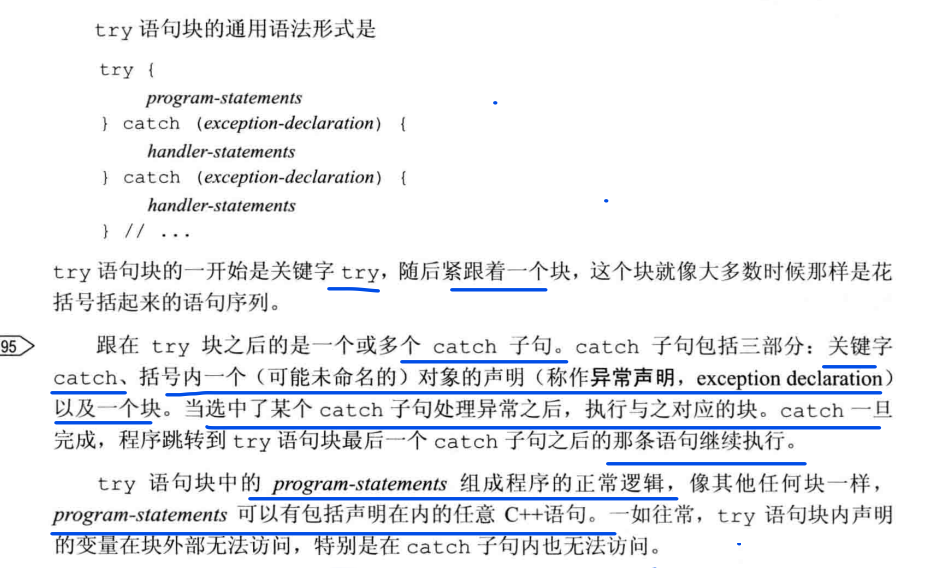
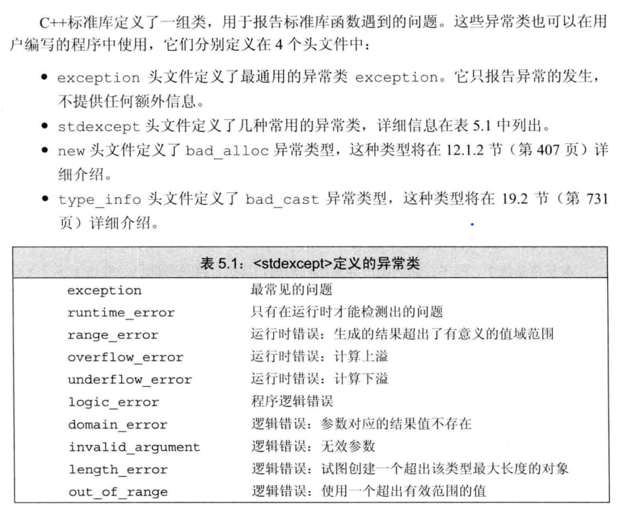

# try语句块和异常处理

异常是指存在于运行时的反常行为，这些行为超出了函数正常功能的范围。

异常处理机制为程序中异常检测和异常处理这两部分协作提供支持，包括：
- throw表达式，异常检测部分使用throw表达式来表示它遇到了无法处理的问题，就说throw引发了异常。
- try语句块，异常处理部分使用try语句块处理异常，通常称为异常处理代码。

## :ghost: throw表达式

程序的异常检测部分使用throw表达式引发一个异常。

throw表达式包含关键字`throw`和紧随其后的异常类型。throw表达式后会紧跟一个分号，从而构成一条表达式语句。

```C++
//首先检查两条数据是否是关于同一种书籍的
if (item1.isbn() != item2.isbn())
    throw runtime_error("Data must refer to same ISBN");
//如果程序执行到这，表示两个ISBN是相同的
cout << item1 + item2 << endl;
```

## :ghost: try语句块
try语句块的通用语法形式是：



## :ghost: 标准异常


