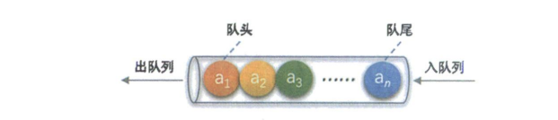

# 栈和队列

## 栈
栈是限定尽在表尾进行插入和删除操作的线性表。

允许插入和删除的一端称为栈顶(top)，另一端称为栈底(bottom)，不含任何数据元素的栈称为空栈。栈又称为后进先出(LIFO)的线性表。

栈是顺序表的特例，栈的顺序存储就是线性表顺序存储的简化，所以简称顺序栈。

## 栈的链式存储结构及实现

### 

## 队列

队列(queue)是只允许在一端进行插入操作，而在另一端进行删除操作的线性表。

队列是一种先进先出(First In First Out)的线性表，简称FIFO。允许插入的一端称为队尾，允许删除的的一端称为队头。

