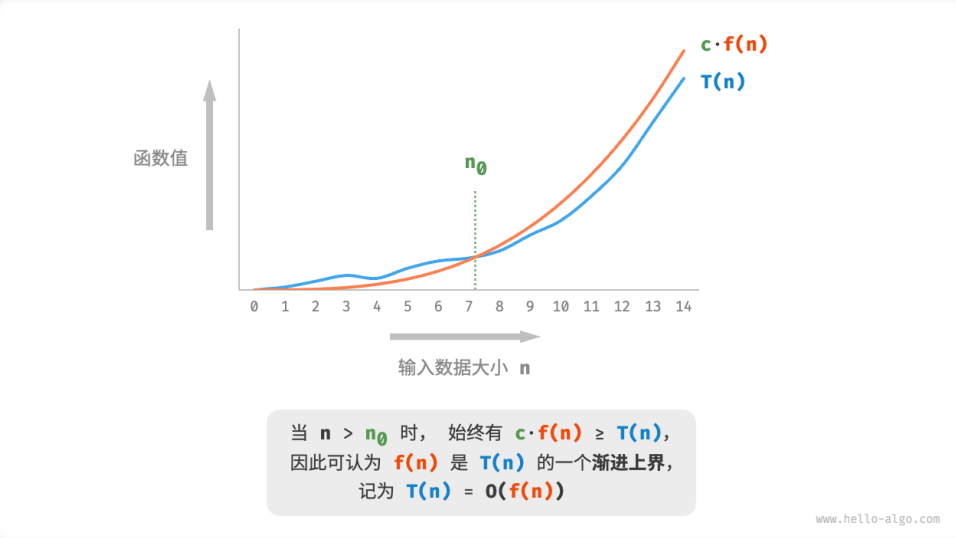
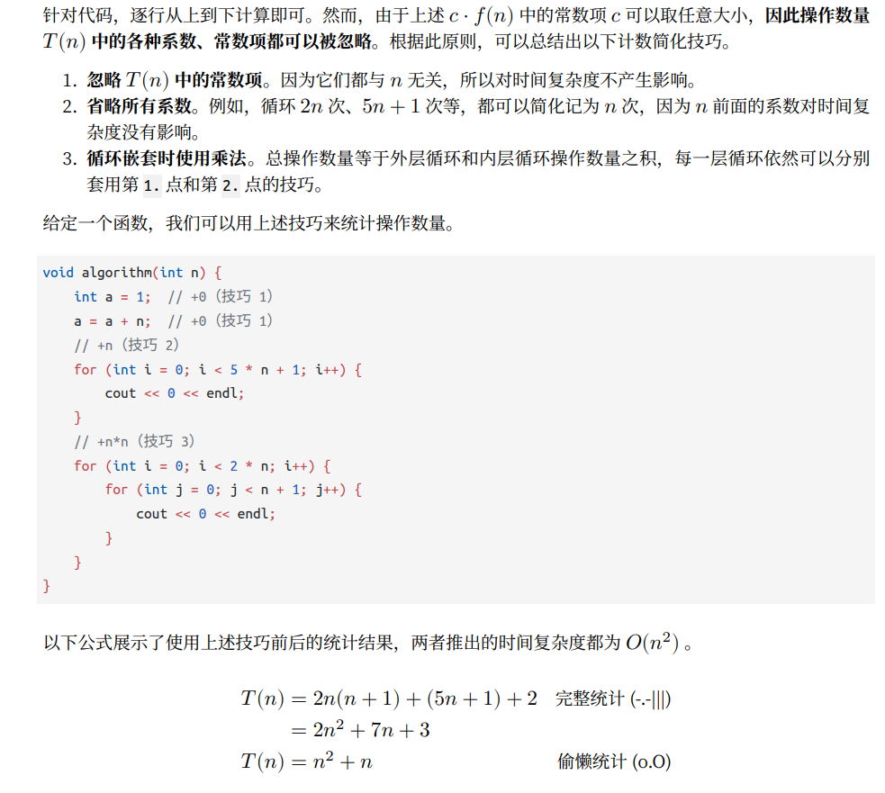
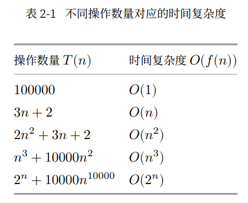
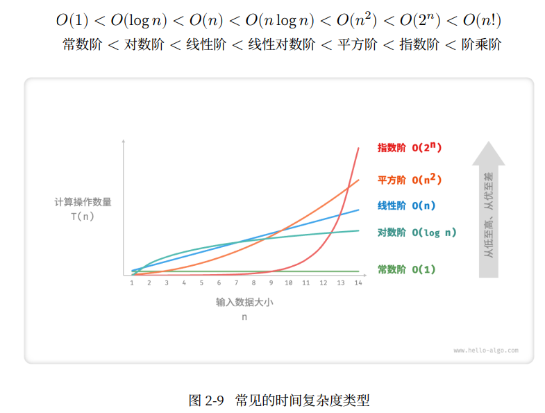

# 效率评估方法
- 实际测试
- 理论估算

## 理论估算

仅通过一些计算来评估算法的效率。这种估算方法被称为渐进复杂度分析[asymptotic complexity analysis]简称：复杂度分析。

它描述了随着输入大小的增加，算法执行所需时间和空间的增长趋势。将其分为三个重点来理解：
- 时间和空间资源分别对应时间复杂度和空间复杂度。
- 随着输入数据大小的增加，意味着复杂度反映了算法运行效率与输入数据体量之间的关系。
- 时间和空间的增长趋势，表示复杂度分析关注的不是运行时间或占用空间的具体值，而是空间或时间增长的快慢。

## 迭代和递归
 
### 迭代
迭代[iteration]是一种重复执行某个任务的控制结构，在迭代中，程序会在满足一定的条件下重复执行某段代码，直到条件不再满足。

### 递归
递归[recursion]是一种算法策略，通过函数调用自身来解决问题。主要包含：

1. 递：程序不断深度地调用自身，通常传入更小或更简化的参数，直到达到“终止条件”。
2. 归：触发“终止条件”后，程序从最深层的递归函数开始逐层返回，汇聚每一层的结果。

从本质上看，递归体现，“将问题分解为更小的子问题”。

### 统计时间增长趋势

时间复杂度分析统计的不是算法运行时间，而是算法运行时间随数据量变大时的增长趋势。

### 函数渐进上界

给定一个输入大小为n的函数，若该函数的操作数量为：

$T(n) = 3 + 2n$

$T(n)$是一次函数，说明其运行时间的增长趋势是线性的，因此它的时间复杂度是线性阶。

我们将线性阶的时间复杂度记为$O(n)$,表示函数$T(n)$的渐进上界。

时间复杂度分析本质是计算“操作数量函数$T(n)$”的渐进上界。

### 推算方法

确定$f(n)$之后，我们便可得到时间复杂度$O(f(n))$。而如何确定渐进上界$f(n)$,可以分为两步：统计操作数量和判断渐进上界。

#### 统计操作数量

#### 判断渐进上界

时间复杂度由多项式$T(n)$中最高阶的项来决定。这是因为n在趋于无穷大时，最高阶的项将发挥主导作用，其他项的影响都可以忽略。

### 常见类型

## 空间复杂度

用于衡量算法占用内存空间随着数据量变大时的增长趋势。
