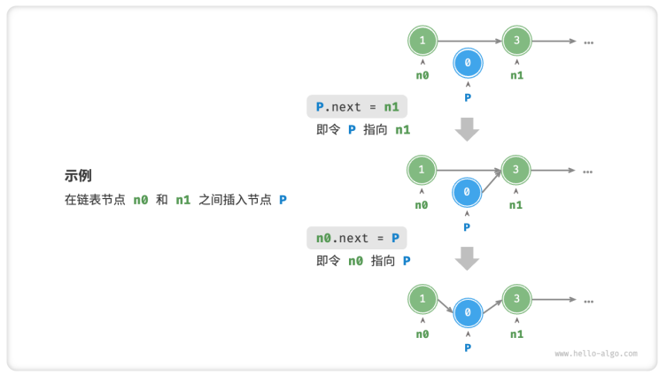
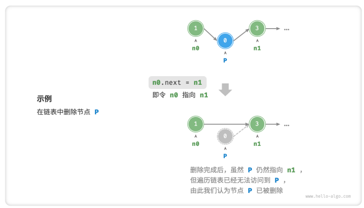
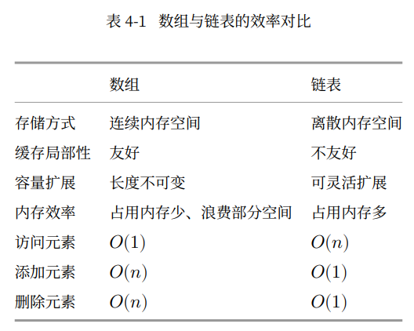

## 数组的优点和局限性
- 空间效率高：连续的内存块，结构简单。
- 支持随机访问：可以根据索引值随意访问任何元素。
- 缓存局部性：访问数组元素时，计算机不仅会加载它，还会缓存其他周围的数据，提高后续操作的执行速度。
***
- 插入与删除效率低
- 长度不可变
- 空间良妃。

# 4.2 链表

链表是一种线性数据结构，其中的每个元素都是一个节点对象，各个节点通过"引用"相连接。引用记录了下一个节点的内存地址，通过它可以从当前节点访问到下一个节点。

链表节点`ListNode`除了包含值，还需要额外保存一个引用(指针)。因此在相同数据量下，链表比数组占用更多的内存空间。

链表的组成单位是节点(node)对象，每个节点都包含两项数据：节点的值和指向下一节点的"引用"。

```C++
struct ListNode{
    int val;        //节点值
    ListNode *next；//指向下一个节点的指针
    ListNode(int x) : val(x),next(nullptr){}    //构造函数
};
```

### 链表常用操作

初始化链表：
- 初始化各个节点对象。
- 构建引用指向关系。

```C++
/*初始化链表 1->3->2->5->4 */
//初始化各个节点
ListNode* n0 = new ListNode(1);
ListNode* n1 = new ListNode(3);
ListNode* n2 = new ListNode(2);
ListNode* n3 = new ListNode(5);
ListNode* n4 = new ListNode(4);

//构建引用指向
n0->next = n1;
n1->next = n2;
n2->next = n3;
n3->next = n4;
```
#### 插入节点


```C++
/* 在链表的节点n0 之后插入节点P*/
void insert(ListNode *n0,ListNode *p){
    ListNode *n1 = n0->next;        //初始化了一个n1的节点
    p->next = n1;
    n0->next = p;
}
```

#### 删除节点



```C++
/*删除链表的节点 n0 之后的首个节点 */
void remove(ListNode *n0){
    if(n0->next == nullptr)
        return;

    //n0 -> p -> n1
    ListNode *p = n0 -> next;
    ListNode *n1 = p -> next;
    n0 -> next = n1;
    //释放内存
    delete p;
}
```

#### 访问节点

链表访问节点的效率较低，不同于访问数组，链表需要从头节点触发，逐个向后遍历，直至找到目标节点。即访问链表的第i个节点需要循环i-1轮，时间复杂度为$O(n)$

```C++
ListNode *access(ListNode *head,int index){
    for (int i =0; i < index; i++)
    {
        if(head == nullptr)
            return nullptr;
        head = head -> next;
    }
    return head;
}
```
#### 查找节点


```C++
/*在链表中查找值为target的首个节点*/
int find(ListNode *head, int target){
    int index = 0;
    while (head != nullptr){
        if(head -> val == target)
            return index;
        head = head -> next;
        index++;
    }
    return -1;
}
```

#### 数组vs链表



#### 常见链表类型

常见的链表包括三种：
- 单向链表
- 环形链表:单向链表的尾节点指向头节点。
- 双向链表：双向链表记录了两个方向的引用，节点定义同时包含指向后继节点(下一个节点)和前驱节点(上一个节点)

```C++
/*双向链表节点结构体*/
struct ListNode{
    int val;    //节点值
    ListNode *next; //指向后继节点的指针
    ListNode *prev; //指向前驱节点的指针
    ListNode(int x) : val(x),next(nullptr),prev(nullptr){}  //构造函数
};
```

链表典型应用：
- 栈与队列
- 哈希表
- 图
- 时间片轮转调度算法(循环链表)
- 数据缓冲区


## 列表

为了缓解数组长度不可变的问题，提出了一种"动态数组"的数据结构，可以称作“列表”。(长度可变)

列表基于数组实现，继承了数组的优点，并且可以在程序运行过程中动态扩容。

### :palm_tree:列表常用操作

#### :deciduous_tree:初始化列表

我们通常使用“无初始值”和“有初始值”两种初始化方法：

```C++
/*初始化列表
*这里的列表就是C++中的vector
*/
//无初始值
vector<int> list1;
//有初始值
vector<int> list = {1,2,3,4,5};
```

#### :deciduous_tree:访问元素

列表的本质上是数组，因此访问和更新元素的复杂度都是$O(n)$:

```C++
/*访问元素*/
int num = list[1];      //访问索引1处的元素

//更新元素
list[1] = 0;            //将索引1处的元素更新为0；
```
#### :deciduous_tree:插入和删除元素

插入和删除元素的效率与数组相同，时间复杂度为$O(n)$

```C++
//清空列表
list.clear();

//尾部添加元素
list.push_back(1);
list.push_back(3);
list.push_back(2);
list.push_back(5);
list.push_back(4);

//中间插入元素
list.insert(list.begin()+3, 6);     //在索引3处添加数字6
//删除元素
list.erase(list.begin()+3);     //删除索引3处的元素
```

#### :deciduous_tree: 遍历列表

```C++
//通过索引遍历列表
int count = 0;
for (int i = 0;i < list.size(); i++)
{
    count++;
}
//直接遍历列表元素
count = 0;
for (int n:list){
    count++;
}
```
#### :deciduous_tree: 拼接列表

```C++
//给定一个新list，我们可以将该列表拼接到原列表的尾部
//拼接两个链表
vector<int> list1 = {6,7,8,9};

//将列表list1拼接到list之后
list.insert(list.end(),list1.begin(),list1.end());
```
#### :deciduous_tree: 排序列表

```C++
sort(list.begin(),list.end());
```

#### :ghost: 列表实现


