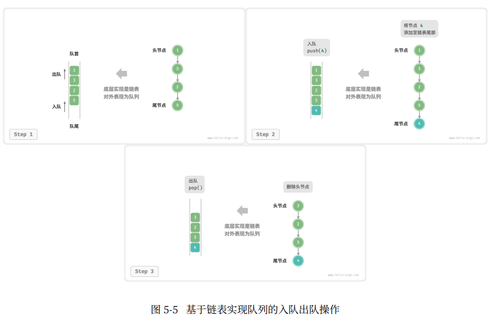

# :fallen_leaf: 栈

栈常用操作


```C++
//初始化栈
stack<int> stack;

//元素出栈
stack.push(1);
stack.push(3);
stack.push(2);
stack.push(5);
stack.push(4);

//访问栈顶元素
int top = stack.top();

//元素出栈
stack.pop();

//获取栈的长度
int size = stack.size();

//判断是否为空
bool empty = stack.empty();
```

## :maple_leaf: 基于链表的栈的实现


## :maple_leaf: 基于数组的栈的实现


# 队列

## 队列的常用操作


C++中现成的队列类：
```C++
//初始化队列
queue<int> queue;

//元素入队
queue.push(1);
queue.push(3);
queue.push(2);
queue.push(5);
queue.push(4);

//访问队首元素
int front = queue.front();

//元素出队
queue.pop()

//获取队列的长度
int size = queue.size();

//判断队列是否为空
bool empty = queue.empty();
```

### 基于链表的实现




### 基于数组的实现


## 双向队列


### 双向链表实现双向队列


### 数组实现双向队列


