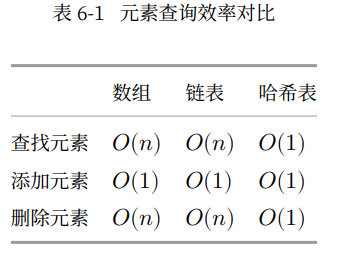
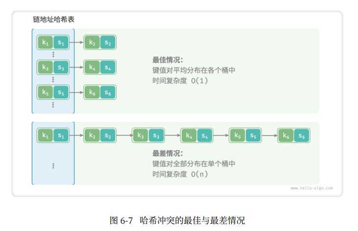

# 哈希表

哈希表[hash table],又称散列表，其通过建立键key与值value之间的映射，实现高效的元素查询。

具体的话，向哈希表输入一个键key，则可以在$O(1)$时间内获取对应值value。

哈希表与数组、链表的效率对比：
- 添加元素：仅需将元素添加至数组(链表)尾部即可，使用$O(1)$时间。
- 查询元素：由于数据(链表)是乱序的，因此需要遍历其中的所有元素，使用$O(n)$时间。
- 删除元素：需要先查询到元素，再从数组(链表)中删除，使用$O(n)$。


## 哈希表的简单实现

将key和和value封装成一个类pair，以表示键值对

```C++
//键值对
struct Pair{
    Public::
    int key;
    string val;
    Pair(int key,string val){
        this->key = key;
        this->val = val;
    }
};

//基于数组实现的哈希表
class ArrayHashMap{
    private:
        vector<Pair *>buckets;
    
    public:
        ArrayHashMap(){
            
        }
}
```


### 链式地址


### 开放寻址


## 哈希算法


