# 二叉树

二叉树是一种非线性数据结构，体现"一分为二"的分治逻辑，每个节点包含：值、左子节点引用、右子节点引用。

```C++
struct TreeNode{
    int val;    //节点值
    TreeNode *left;
    TreeNode *right;
    TreeNode(int x): val(x),left(nullptr),right(nullptr){}
};

```

## 二叉树常用术语
- 根节点：位于二叉树顶层的节点，没有父节点
- 叶节点：没有子节点的节点，其两个指针都指向nullptr；
- 边edge：连接两个节点的线段，即节点引用(指针)
- 节点层level：节点的子节点的数量，在二叉树中这个值一般为0,1,2；
- 二叉树的高度height：从根节点到最远子节点的边的数量；
- 节点的深度depth：从根节点到该节点所经过边的数量
- 节点的高度height：从最远子节点到给节点的边的数量

### 插入和删除节点
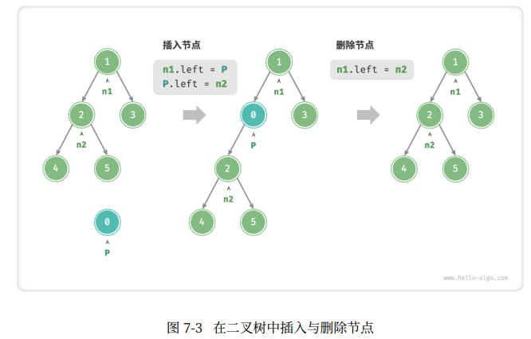

```C++
//插入和删除节点
TreeNode* P = new TreeNode(0);
//在n1->n2间插入节点p
n1->left = P;
P->left = n2;

//删除节点P
n1->left = n2;
```

### 常见二叉树

- 完美二叉树：除了最底层外，其余所有层的节点都被完全填满。叶节点的度为0，其余所有节点的度为2。若树的高度为h，则节点总数为$2^{h+1}-1$.

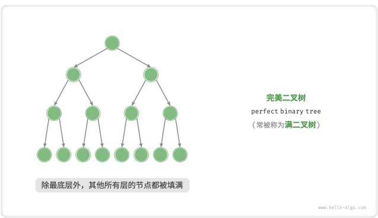

- 完全二叉树：只有最底层的节点未被填满，且最底层节点尽量靠左填充。

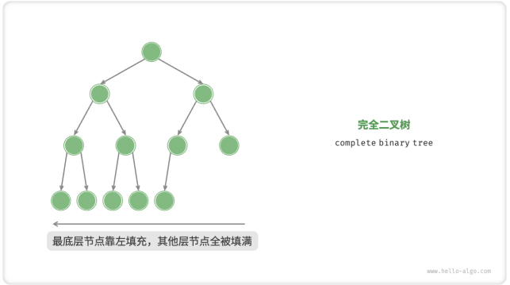


- 完满二叉树：除了叶节点之外，其余所有节点都有两个子节点。

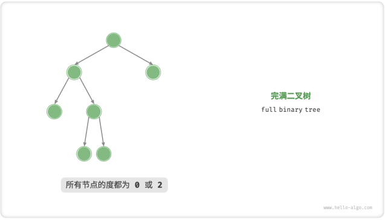

- 平衡二叉树：任意节点的左子树和右子树的高度之差的绝对值不超过1。

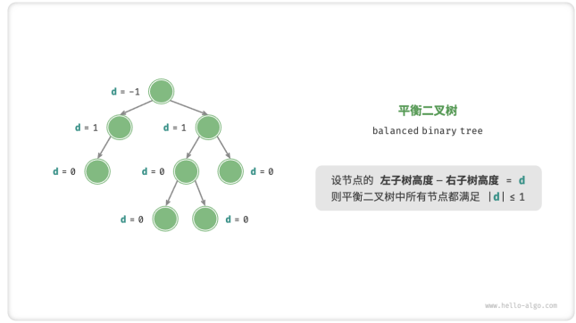

### 二叉树的退化

当二叉树的每层节点都被填满时，达到"完美二叉树"；而当所有节点都偏向一侧时，二叉树退化为"链表"。
- 完美二叉树是理想情况，可以充分发挥二叉树"分治"的优势。
- 链表是另一个极端，所有操作都退化为线性操作。

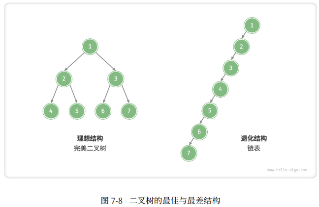

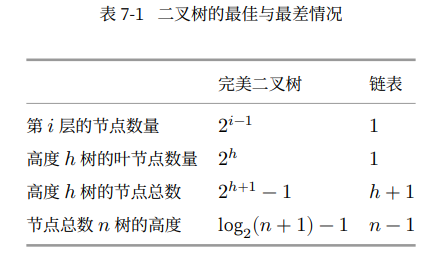

## 二叉树遍历

二叉树常见的遍历方式：层序遍历、前序遍历、中序遍历和后序遍历。

### 层序遍历

层序遍历(level-order traversal)是从顶部到底部逐层遍历二叉树，并在每层按照从左到右的顺序访问节点。

层序遍历本质上属于广度优先遍历(breadth-first traversal),他体现了一种一圈一圈向外扩展的逐层遍历方式。

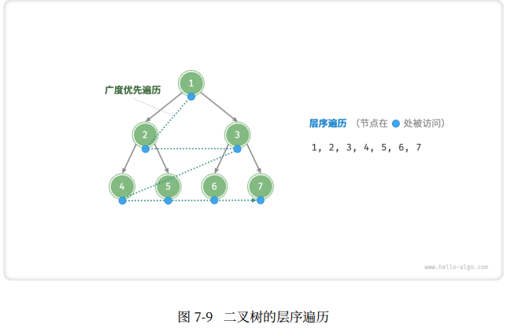

广度优先遍历通常借助队列实现。(队列是先进先出，广度优先遍历是逐层推进)

```C++


//层序遍历
vector<int> levelOrder(TreeNode* root){
    //初始化队列，加入根节点
    queue<TreeNode *> queue;
    queue.push(root);

    //初始化一个列表，用于保存遍历序列
    vector<int> vec;

    while(!queue.empty()){
        TreeNode *node = queue.front();     //
        queue.pop();            //队列出队
        vec.push_back(node->val);   //保存节点值
        if(node->left != nullptr)
            queue.push(node->left);     //左子节点入队
        if(node->right != nullptr)
            queue.push(node->right);    //右子节点入队        
    }
    return vec;
}
```

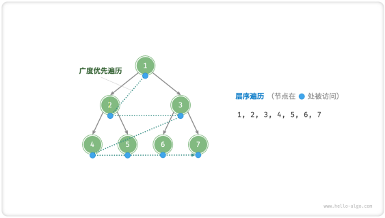

### 前序、中序、后序遍历

这三种遍历方式都属于深度优先遍历(depth-first traversal),体现了一种"先走到尽头，再回溯继续"的遍历方式。

- 时间复杂度O(n)
- 空间复杂度O(n)

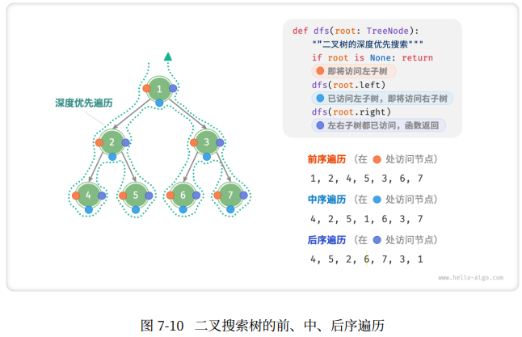

```C++
//前序遍历
void preOrder(TreeNode *root){
    if(root == nullptr)
        return;
    //访问优先级：根节点 -> 左子树 -> 右子树
    vec.push_back(root->val);
    preOrder(root->left);
    preOrder(root->right);

}

//中序遍历
void inOrder(TreeNode *root){
    if(root == nullptr)
        return;

    //访问优先级：左子树 -> 根节点 -> 右子树
    inOrder(root -> left);
    vec.push_back(root->val);
    inOrder(root -> right);
}


//后序遍历
void postOrder(TreeNode *root){
    if(root == nullptr)
        return;
    
    //访问优先级：左子树 -> 右子树 -> 根节点
    postOrder(root -> left);
    postOrder(root -> right);
    vec.push_back(root -> val);
}

```

## 二叉树数组表示


## 二叉搜索树的操作

### 查找节点

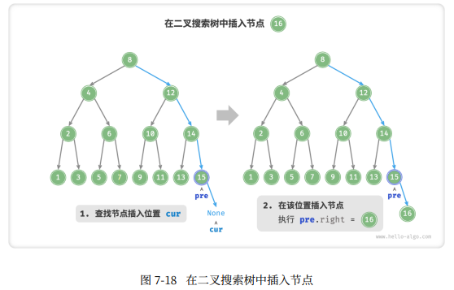


### 删除节点

#### 度为0
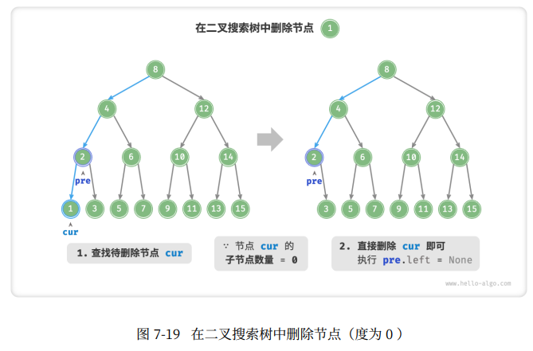

#### 度为1

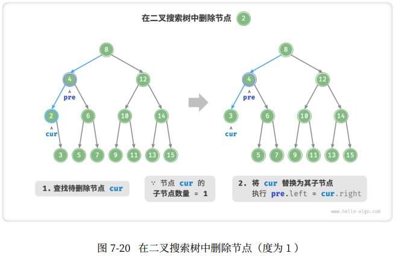


### 二叉搜索树的效率

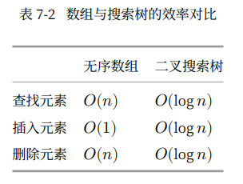


### AVL树

提出AVL树，确保在持续添加和删除节点后，AVL树不会退化，从而使得各种操作的时间复杂度保持在O(logn)级别。

>在需要频繁进行增删查改操作的场景中，AVL树能始终保持高效的数据操作性能，具有很好的应用价值。

AVL树既是二叉搜索树也是平衡二叉树，因此也被称为平衡二叉搜索树(balanced binary search tree)

```C++
//AVL树节点类
struct TreeNode{
    int val{};      //节点值
    int height = 0  //节点高度
    TreeNode *left{};   //左子节点
    TreeNode *right{};   //左子节点
    TreeNode() = default;
    explicit TreeNode(int x) : val(x){};
};
```


##### 平衡因子

节点的平衡因子(balance factor)定义为节点左子树的高度减去右子树的高度，同时规定空节点的平衡因子为0

```C++
int balanceFactor(TreeNode *node){
    //空节点平衡因子为0
    if(node == nullptr){
        return 0;
    }

    //节点平衡因子 = 左子树高度 - 右子树高度
    return height(node->left) - height(node->right);
}
```

> AVL树的特点在于旋转操作，能够在不影响二叉树的中序遍历序列前提下，使失衡节点重新恢复平衡。旋转操作既能保持"二叉搜索树"的性质，也能使树重新变为平衡二叉树。

一般将平衡因子绝对值>1的节点称为失衡节点，根据节点的失衡情况，旋转操作分为：右旋、左旋、先右旋后左旋、先左旋后右旋。


#### 右旋

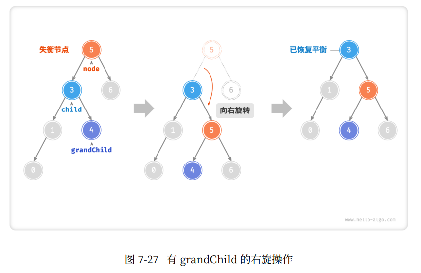

右旋是一种形象化说法，实际上通过修改节点指针来实现：

```C++
TreeNode *rightRotate(TreeNode *node){
    TreeNode *child = node->left;
    TreeNode *grandChild = child->right;

    //以chile为原点，将node向右旋转
    child->right = node;
    node->left = grandChild;

    //更新节点高度
    updateHeight(node);
    updateHeight(child);

    //返回旋转后子树的根节点
    return child;
}
```

