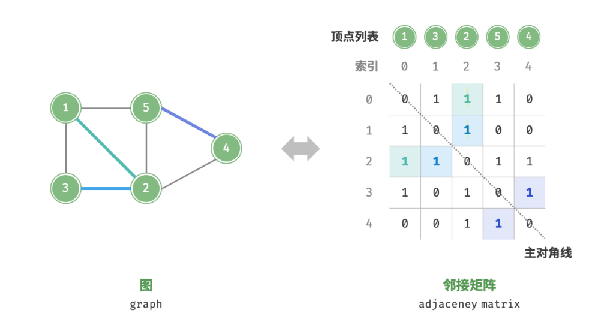
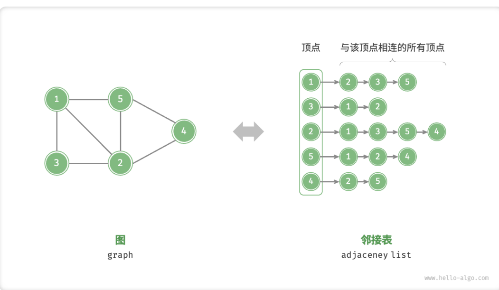
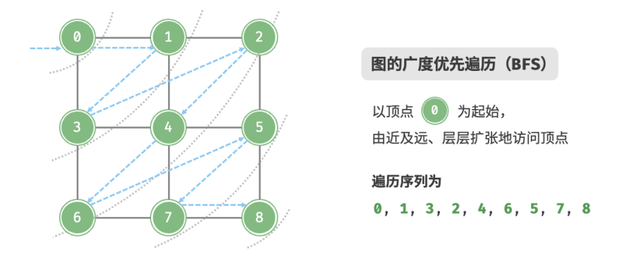

# 图

## 图的表示

### 邻接矩阵

邻接矩阵具有以下特性：
- 顶点不能与自身相连，因此邻接矩阵主对角线元素没有意义。
- 对于无向图，两个方向的边等价，此时邻接矩阵关于主对角线对称。
- 将邻接矩阵的元素从1和0替换为权重，则可表示为有权图。

### 邻接表

邻接表(adjacency list)使用n个链表来表示图，链表节点表示顶点。第i条链表对应顶点i，其中存储了该顶点的所有邻接顶点(即与该顶点相连的顶点)。

## 图的遍历

树和图都是需要应用搜索算法来实现遍历操作的。

图的遍历方式分为两种：广度优先遍历[breadth-first traversal](或者广度优先搜索，BFS)和深度优先遍历[depth-first traversal](DFS)

### 广度优先遍历

广度优先遍历是一种由近及远的遍历方式，从某个节点出发，始终优先访问距离最近的节点，并一层层向外扩张。

BFS通常借助队列来实现，具有"先入先出"的性质。
- 将遍历起始顶点`startVet`加入队列，并开启循环。
- 在循环的每轮迭代中，弹出队首顶点并记录访问该顶点的所有邻接顶点加入到队列尾部。
- 循环上一步，直到所有顶点被访问完成后结束。
