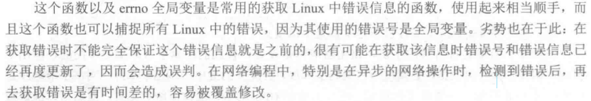

# 套接字基础
Linux用户态网络编程主要基于套接字API，套接字API是Linux提供的一种网络编程接口。

套接字编程API，使得开发人员既可以在传输层上进行网络编程，也可以跨越传输层直接对网络层进行开发。

套接字编程可以分为TCP套接字编程、UDP套接字编程和原始套接字编程。

> Socket的中文称呼是套接字或套接口，是TCP/IP网络编程中的基本操作单元，可以看做是不同主机进程至今相互通信的端点。

>套接字是应用层与TCP/IP协议簇通信的中间软件抽象层，一组接口把复杂的TCP/IP协议簇隐藏在套接字接口后面。某个主机上的某个进程通过该进程中定义的套接字可以与其他主机上同样定义了套接字的集成建立通信，传输数据。

Linux下有两套套接字实现：
- 伯克利套接字(Berkeley Sockets)
- 传输层接口(Transport Layer Interface, TLI),是System V系统上的网络编程API。

Socket是在应用层和传输层之间的一个抽象层，把TCP/IP层的复杂操作抽象为几个简单的接口供应用层调用已实现的进程在网络中通信。

Socket编程接口其实就是用户进程(应用层)和传输层之间的编程接口。

基于套接字的网络编程中，通常使用C/S架构，一个简单的客户机和服务器之间的通信过程：
- 客户机向服务器提出一个请求。
- 服务器收到客户机的请求，进行分析处理。
- 服务器将处理的结果返回客户机。

## 套接字类型
- 流套接字(SOCK_STREAM)
    - 面向连接的、可靠的、无差错的、无重复发送(使用TCP协议)
- 数据报套接字(SOCK_DGRAM)
    - 无连接的、不保证数据传输的可靠性(使用UDP协议)
- 原始套接字(SOCK_RAW):面向低层次协议的(IP、ICMP)。

原始套接字与另外两个的区别是：原始套接字可以读写内核没有处理的IP数据包，而流套接字只能读取TCP，数据报套接字只能读取UDP协议的数据。

## 主机字节序和网络字节序

### 主机字节序

### 网络中的字节序

是TCP/IP中规定好的一种数据表示格式，与CPU、操作系统无关。

采用大端排序方式。

所以需要将数据由主机的字节序转换为网络字节序后再发出，同理接收方也需要转为主机字节序后再进行处理。

## 出错信息的获取

可以通过下面几种方式来获取更为全面的出错信息：
### 通过全局变量errno

### 通过函数strerror

这个函数以及`errno`全局变量是常用的获取linux中错误信息的函数，使用非常方便，可以捕获所有Linux中的错误，

### 通过函数gai_strerror

### 通过函数getsockopt

