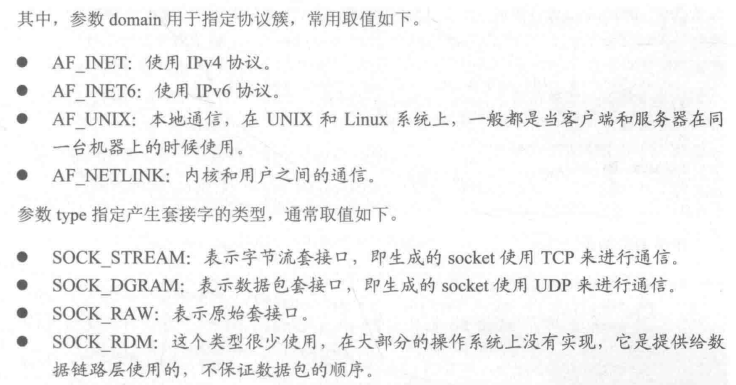

# TCP套接字编程

## 基本步骤

流套接字(SOCK_STREAM)编程针对的是TCP协议通信，面向连接的通信，分为服务器端和客户端两部分，基本步骤为：

### 服务器端编程：


### 客户端编程：


## 协议簇和地址簇

协议簇就是不同协议的集合，在Linux中用宏来表示不同的协议簇，这个宏的形式是PF开头，


地址簇就是一个协议所使用的地址集合，也是用宏来表示不同的地址簇，这个宏的形式是AF开头：


地址簇和协议簇其实是一样的，值也是一样的，都是用来识别不同的协议的。只是UNIX的两个风格的系统，BSD系统使用AF，POSIX系统使用PF。

## socket地址

一个套接字代表通信的一端，每端都有一个套接字地址，这个socket地址包含IP地址和端口信息，有了这些就能从网络找那个识别对方的主机，就能识别对方主机的进程。

socket地址可以分为通用socket地址和专用socket地址。前者会出现`bind`函数、`connect`函数等，两者可以相互转换。


### 通用socket地址

通用`socket`地址就是一个结构体，名字是`sockaddr`,定义在`bits/socket.h`(linux下可以从/usr/include/x86_64-linux-gnu/bits下找到)
```C++
/* Get the definition of the macro to define the common sockaddr members.  */
#include <bits/sockaddr.h>

/* Structure describing a generic socket address.  */
struct sockaddr
  {
    __SOCKADDR_COMMON (sa_);	/* Common data: address family and length.  */
    char sa_data[14];		/* Address data.  */
  };
```

改写宏定义后：
```C++
struct sockaddr
{
    sa_family_t sa_pfamily; //是个短整型变量，用来存放地址簇或协议簇类型，常取值：
    /*
    PF_UNIX:UNIX本地域协议簇
    PF_INET:IPv4协议簇
    PF_INET6:IPVv6协议簇

    AF_UNIX:UNIX本地域协议簇
    AF_INET:IPv4协议簇
    AF_INET6:IPVv6协议簇
    */
    char sa_data[14];
}
```


### 专用socket地址

Linux为不同的协议簇定义了不同的`socket`地址结构体：


### IP地址的转换

IP地址转换函数用于完成点分十进制IP地址与二进制IP地址之间的相互转换。

## inet_aton  |  inet_addr  |  inet_ntoa


这三个地址转换函数都只能处理IPv4地址。


### TCP套接字编程的相关函数

#### socket函数

无论是服务端还是客户端，都需要先调用`socket`函数，用于建立两端通信的端点。声明如下：
```C++
#include <sys/types.h>
#include <sys/socket.h>
int socket(int domain, int type, int protocol);
//domain用于指定协议簇 参数protocol通常取0
//函数执行成功，则返回一个正整数值，该值通常称为套接字描述符，失败返回-1；
```



#### bind函数

该函数让本地地址信息关联(或绑定)到一个套接字上。

服务器程序必须调用`bind`函数来给其绑定自己的IP地址和一个特定的端口号。客户端程序一般不必调用`bind`函数来为其套接字绑定IP地址和端口号，客户端程序通常会用默认的IP和端口号来与服务器程序通信。声明：
```C++
#include <sys/socket.h>
int bind(int sockfd, const struct sockaddr *addr, socklen_t addrlen);

//参数sockfd标识一个待绑定的套接字描述符(由socket函数产生)
//addr是一个结构体sockaddr的指针，指向要绑定给sockfd的协议地址
//addrlen指定addr的缓冲区长度，socklen_t 相当于int
//要使用socklen_t需要包含头文件<sys/socket.h>和<unistd.h>

//函数成功返回0
```


给套接字应用`SO_REUSEADDR`套接字选项，方便端口可以马上重用
```C++
int on = 1;
setsockopt(sfp,SOL_SOCKET, SO_REUSEADDR,&on, sizeof(on)); //允许地址的立即重用
```


#### listen函数

用来监听客户端发来的建立连接的请求：
```C++
#include <sys/socket.h>
int listen(int s, int backlog);
```


#### accept函数
该函数用与服务程序从处于监听状态的流套接字的客户连接请求中取出摆在最前面的一个客户端请求，并且创建一个新的套接字来与客户套接字创建连接通道。

```C++
#include <sys/socket.h>
int accept( int s, struct sockaddr *addr, socklen_t *addrlen);
```

#### connect函数

该函数用于在套接字上建立一个TCP链接，用在客户端，客户端使用connect函数请求与服务器的监听套接字建立TCP连接，声明如下：

```C++
#include <sys/socket.h>
int connect(int s, const struct sockaddr* name, socklen_t namelen);
```

#### write函数

`write`函数用于在已建立连接的soceket上发送数据，无论是客户端还是服务器端都用`write`函数向TCP连接的另一端发送数据。

但它只是把参数buf中的数据发送到套接字的发送缓冲区中，此时数据并不一定马上成功地被传到连接的另一端，发送数据到接收端是底层协议完成的。函数声明如下：

```C++
#include <unistd.h>
int write(int s, const char* buf, int len)
```

#### read函数
该函数从连接的套接字或无连接的套接字上接收数据，函数声明为：

```C++
int read(int s, char* buf, int len);
```


#### send函数

send函数和write函数类似，都是用来发送数据的，只不过多了一个附加参数：
```C++
#include <sys/socket.h>
#include <sys/types.h>
ssize_t send(int sockfd, const void* buf, size_t len, int flag);
```


#### recv函数

和read函数类似，recv函数也是用于数据的发送操作，只不过是多了一个附加参数，函数声明：
```C++
#include <sys/socket.h>
#include <sys/types.h>
ssize_t recv(int sockfd, void* buf,size_t len, int flag);
```


#### close函数
close函数用于关闭套接字，并立即返回。声明为：
```C++
#include <unistd.h>
int close(int sockfd);
```


