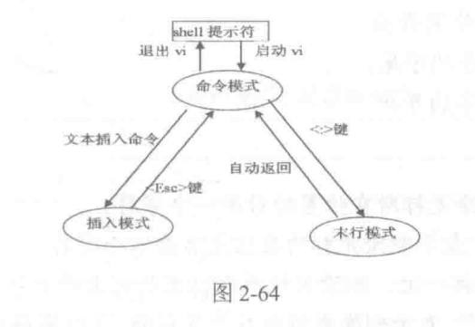
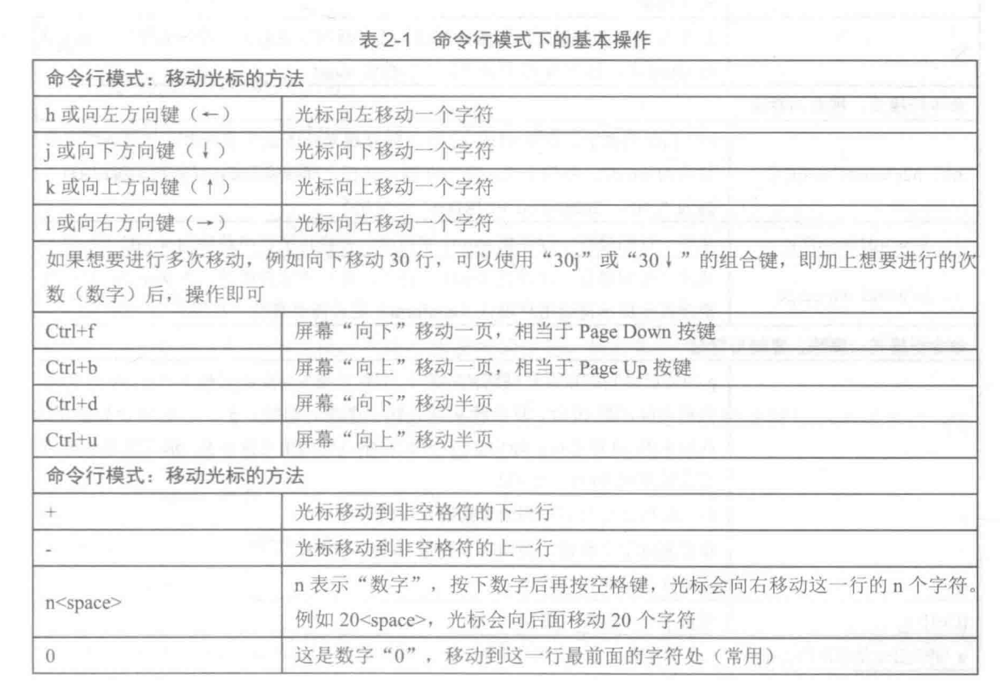
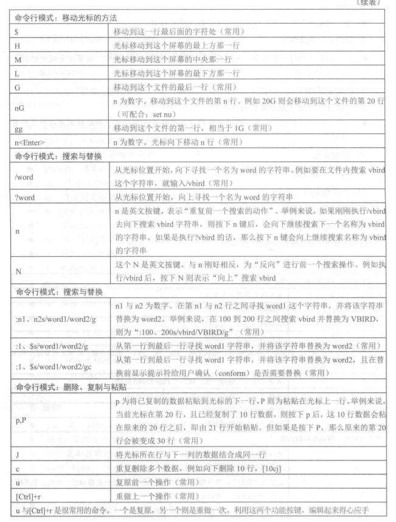
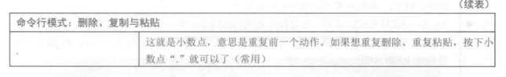
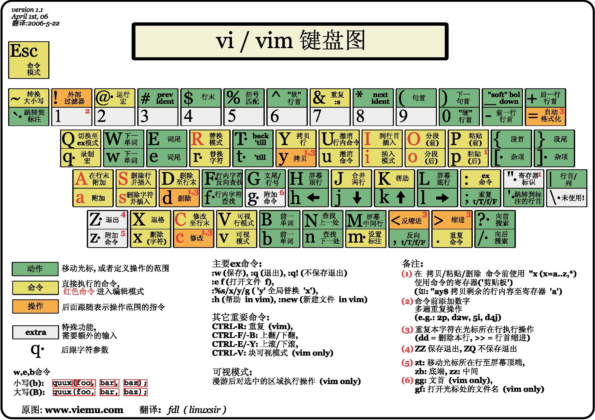
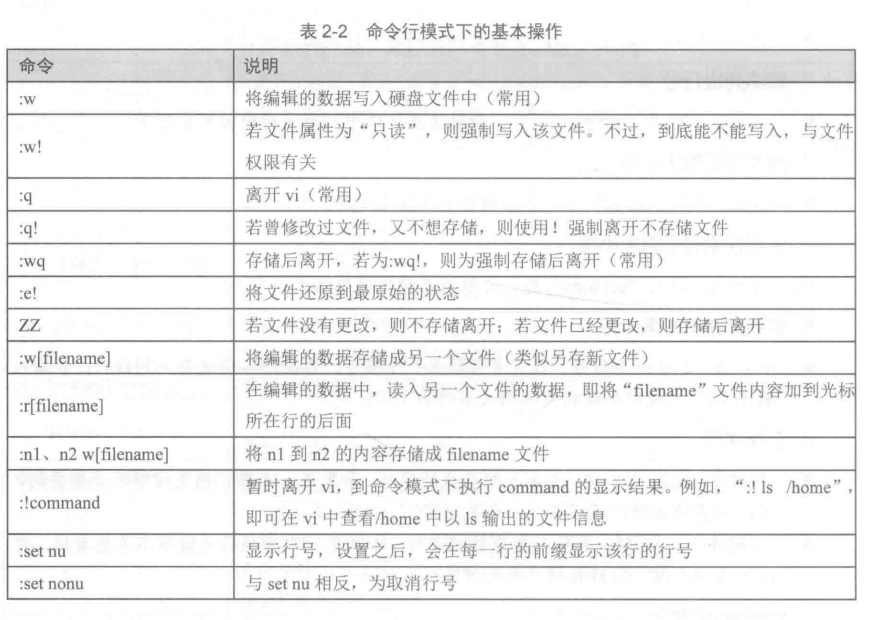
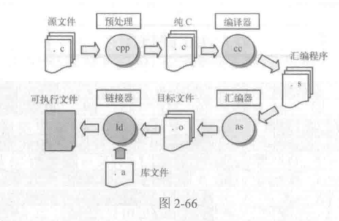
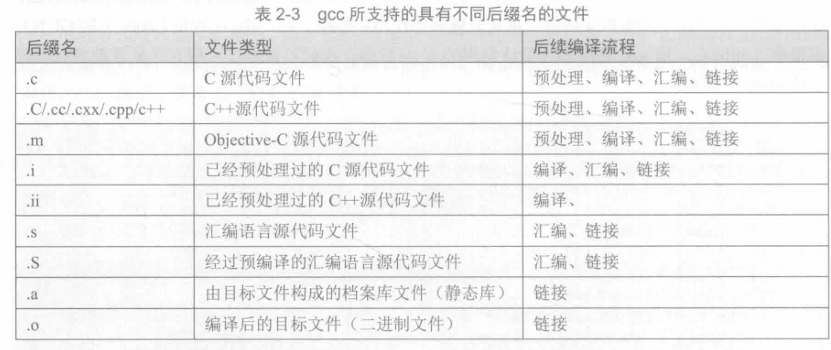
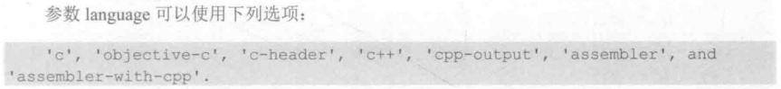

# vi编辑器的使用
## vi编辑器的3种基本工作模式
- 命令行模式(控制屏幕光标的移动，字符、字或行的删除，移动，复制某区域及进入插入模式，或者到末行模式)
- 插入模式
- 末行模式



### 进入插入模式
按下列字符键时就可以进入插入模式：
- a:从目前光标所在位置的下一个位置开始输入文字。
- A:在光标所在行的行末插入。
- i:从光标当前的位置开始输入文件。
- I:在光标所在行的行首插入。
- o:在光标所在行的下面插入一行。
- O:在光标所在行的上面插入一行。
- s:删除光标后的一个字符，然后进入插入模式。
- S:删除光标所在的行，然后进入插入模式。


### 退出插入模式进入命令行模式

直接按`ESC`键从插入模式切换为命令行模式。

### 移动光标
正规的vi是用英文字母"h"、"j"、"k"、"l"分别控制光标左下上右移一格。
- Ctrl+B：屏幕往后移动一页
- Ctrl+F：屏幕往前移动一页
- Ctrl+U：屏幕往后移动半页
- Ctrl+D：屏幕往前移动半页
- gg: 移动到文件的开头
- G: 移动到文件的末尾
- $: 移动到光标所在行的行尾
- ^: 移动到光标所在行的行首
- w: 光标跳转到下个字的开头
- e: 光标跳转到下个字的字尾。
- b: 光标回到上个字的开头。

### 删除文字
- x: 每按一次，删除光标所在位置的后面一个字符。
- nx: 删除光标所在位置后的6个字符。
- X: 大写的X，每按一次，删除光标所在位置的前面一个字符。
- nX: 删除光标所在位置的前面n个字符。
- dd: 删除光标所在行。
- ndd: 从光标所在行开始删除n行。

### 复制
- yw: 将光标所在之处到字尾的字符复制到缓冲区中。
- nyw: 复制n个字符到缓冲区中。
- yy: 复制当前行
- nyy: 复制从当前光标开始的n行字符。

### 剪切
- dd: 剪切当前行。

### 粘贴
- p: 将缓冲区内的字符粘贴到光标所在位置的后面。

### 撤销上一次操作
- u: 如果误执行一个命令，可以马上按下u键，回到上一个操作。按多次u键可以执行多次撤销操作。

### 跳转到指定的行
- Ctrl+G: 列出光标所在行的行号
- nG: 移动光标到该文件的第5行行首，行跳转都是基于文件首行的。

### 存盘退出
- ZZ: 存盘退出

### 不存盘退出
- ZQ: 不存盘退出


## 命令行模式操作小结








## 末行模式操作
ESC后，按`:` 进入末行模式：
### 列出行号
- set nu: 输入“set nu”，会在文件的每一行前面列出行号。
### 取消列出行号
- set nonu: 输入"set nonu"会去取消在文件中每一行前面列出的行号。
### 搜索时忽略大小写
- set ic: 输入"set ic"后，会在搜索时忽略大小写。

### 取消搜索时忽略大小写
- set noic: 取消在搜索时忽略大小写。

### 跳到文件中的某一行
- n：在冒号输入一个数字，再按回车键就会跳到该行。

### 查找字符
- /关键字: 先按`/`键，再输入想查找的字符，如果第一次查找的关键字不对，就一直按n键，往后查找一个关键字。
- ?关键字：先按`?`，再输入想查找的字符，如果第一次查找的关键字不是想要的，可以一直按n键，往后查找一个关键字。

### 运行shell命令
- !cmd: 运行shell命令

### 替换字符
- s/djw/ddd/g: 把当前光标所处的行中的djw单词替换成ddd，并把所有的djw高亮显示。
- %s/djw/ddd: 把文档中所有djw替换成ddd。
- n1,n2 s/djw/ddd/g: n1、n2表示数字，表示从n1行到n2行的替换。

### 命令行模式小结



# gcc编译器的使用

## gcc对C/C++语言的编译过程可分为4个过程：
- 预处理(Preprocess)
- 编译(Compilation)
- 汇编(Assembly)
- 链接(Linking)



### 预处理

预处理就是对源程序中的伪指令(#宏定义、条件编译、include等)和特殊符号进行处理的过程。gcc对`C`源文件预处理后会输出`.i`文件

```Shell
gcc -E test.c -o test.i
```
`-E`是告诉gcc只进行预处理


### 编译
编译过程就是把预处理完的文件进行一系列词法分析，语法分析，语义分析及优化后生成相应的汇编代码文件。

```Shell
gcc -S test.i -O test.s
```
经过编译阶段，`test.i`文件转化为汇编语言文件。


### 汇编
汇编是将汇编代码转变成机器可以执行的二进制代码，每一个汇编语句几乎都对应一条机器指令。

```Shell
gcc -c test.s -o test.o
```
`-c`告诉gcc只进行到汇编处理为止。

### 链接
链接主要是为了解决多个文件之间符号引用的问题。

```shell
gcc test.o -o test
```

### gcc 支持后缀文件



### gcc语法格式

`gcc [选项] 准备编译的文件 [选项] [目标文件]`

### gcc常用选项

#### 没有任何选项
结果会在与源文件`test.c`相同的目录下产生一个`a.out`可执行文件。比如，`gcc test.c`,将生成可执行文件`a.out`。

#### 选项-x(-x language filename)
           

#### 选项-o
选项-o用于指定要生成的结果文件，后面跟的就是结果文件名字。

#### 选项-c
选项`-c`告诉gcc对源文件进行编译和汇编，但不进行链接。

#### 选项-I
选项`-I`，用来指定头文件所在文件夹的路径，用法为`-I dirPath`


#### 选项-include
选项-include的使用方式：
`gcc [srcfile] -include [headfile]`
在使用时可以：
```C++
gcc test.cpp -include /zww/inc/test.h -o test
```

#### 选项-Wall
选项-Wall显示所有警告信息。
可以这样使用：
`gcc test.cpp -Wall -o test`

#### 选项-g
选项`-g`可以产生供gdb调用的可执行文件。

可以这样使用：
`gcc test.cpp -g -o test`

#### 选项-pg
选项`-pg`能产生供`gprof`剖析用的可执行文件。


#### 选项-l
选项-l可以用来链接共享库(动态链接库)。共享库是可执行程序运行时需要用到的一个函数库。`-l`的用法是后面直接添加动态库的名字。

`gcc test.cpp -lstdc++ -o test`

***
### gdb调试器的使用
`gdb`主要有下面4个方面的功能
- 启动你的程序，可以按照自定义的要求运行程序。
- 可以让被调试的程序在指定的地方停下来。
- 当程序被停下时，可以检查此时程序中所发生的事，如查看变量值。
- 动态改变你的程序的执行环境。


