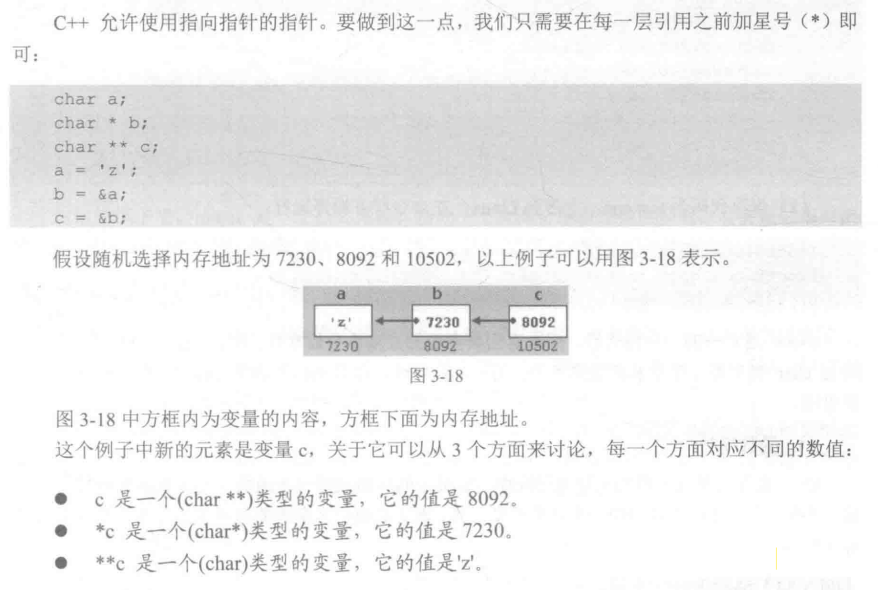
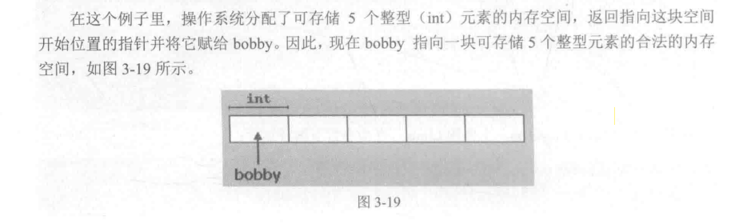
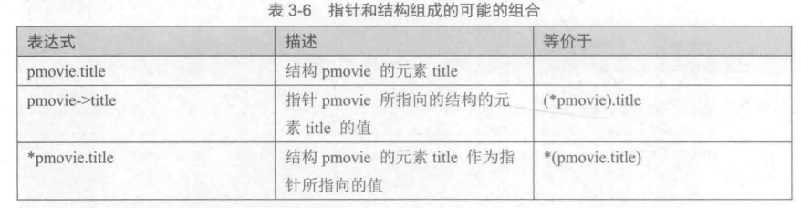
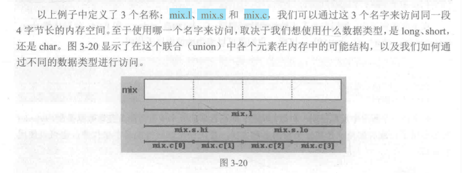
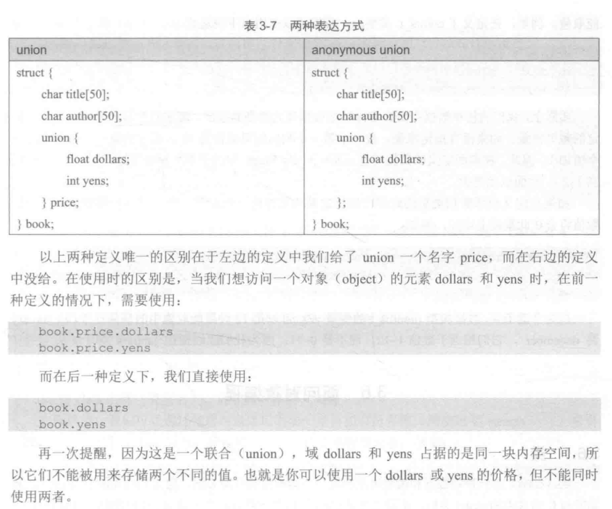

# 使用关键字auto
- 使用auto定义变量时，必须同时进行初始化，以便编译器推导出变量的类型。
- auto相当于一个类型占位符，等到编译的时候推导出实际类型后再替换成真正的类型。
- 同时定义多个变量时，要避免二义性。
- auto不能用于函数参数。


## cin和字符串
`cin >>`只能读取一个单词，碰到空格，读取工作就会停止。
所以，为了读取一整行输入，需要使用C++中的`getline`，相当于使用cin。

```C++
#include <iostream>
#include <string>

int main()
{
    string mystr;
    cout << "What's your name?";
    getline(cin,mystr);
    cout << "Hello" << "mystr" << endl;
    cout << "What's your favorite color?";
    getline(cin,mystr);
    cout << "I like " << mystr << "too~" << endl;
    return 0;
}
```

## 字符串流
标准头文件`<sstream>`定义了一个叫做`stringstream`的类，使用这个类可以对基于字符串的对象进行像流一样的操作。这样，我们就可以对字符串进行抽取和插入操作，这对字符串与数值互相转换非常有用。

```C++
#include <iostream>
#include <string>
#include <sstream>

using namespace std;
int main()
{
    string mystr;
    float price = 0;
    int quantity = 0;
    cout << "Enter price:";
    getline(cin,mystr);
    stringstream(mystr) >> price;
    cout << "Enter quantity:";
    getline(cin,mystr);
    stringstream(mystr) >> quantity;
    cout << "Total price:" << price*quantity << endl;
    return 0;
}
```


## 函数高级话题
### 参数按数值传递和按地址传递
类似于`z = addition(x,y);`，在调用函数后，对变量a或b所做的任何修改都不会影响函数外面的变量x和y
的值，因为变量x和y并没有把它们自己传递给函数，而只是传递了它们的数值。

但是在某些情况下，你需要再一个函数内控制函数外的变量，这时就需要使用按地址传递参数(arguments passed by reference)

```C++
#include <iostream>
using namespace std;

void duplicate(int& a, int& b,int& c)
{
    a *= 2;
    b *= 2;
    c *= 2;
}

int main()
{
    int x = 1, y = 3, z = 7;
    duplicate(x,y,z);
    cout << x << y << z << endl;
    return 0;
}
```

### 按地址传递是使函数返回多个值
```C++
#include <iostream>
using namespace std;

void prevnext(int x, int& prev,int& next)
{
    prev = x - 1;
    next = x + 1;
}

int main()
{
    int x = 100,y,z;
    prevnext(x,y,z);
    cout << y << z << endl;
    return 0;
}
```

### 函数重载
函数重载(Overload)的意思是，两个不同的函数可以用同样的名字，只要它们的参量和原型不同。

```C++
int divide(int a,int b)
{
    return (a/b);
}
```


### 内联函数
`inline`指令可以被放在函数声明之前，要求该函数必须在被调用的地方以代码的形式被编译。

好处是只对短小的函数有效，编译结果的运行会更快一些。

`inline type name (arguments) {instructions}`

### 递归


### 函数声明

将函数定义写在main函数之后时，需要给出函数的声明。

```C++
#include <iostream>
using namespace std;
void odd(int a);
void even(int a);

int main()
{
    ...
}

void odd(int a)
{
    ...
}

void even(int a) 
{
    ...
}
```

### 指针的指针


### 空指针
指针void特殊类型的指针，可以指向任意类型的类型，可以使整数、浮点数，甚至是字符串。

空指针的应用之一就是给函数传递通用参数。

```C++
#include <iostream>

using namespace std;
void increase(void* data, int type)
{
    switch(tyep){
        case sizeof(char):
        (*((char*)data))++;
        break;
        case sizeof(short):
        (*((short*)data))++;
        break;
        case sizeof(long):
        (*((long*))data)++;
        break;
    }
}

int main()
{
    char a = 5;
    short b = 9;
    long c = 12;
    increase(&a, sizeof(a));
    increase(&b, sizeof(b));
    increase(&c, sizeof(c));
    cout << a << b << c << endl;
    return 0;
}
```

### 函数指针
C++允许对指向函数的指针进行操作。它最大的作用就是把一个函数作为参数传递给另一个函数。

声明一个函数指针就像声明一个函数原型一样，除了函数的名字需要被括在括号内并在前面加上`*`星号。

```C++
#include <iostream>
using namespace std;
int addition(int a, int b)
{
    return (a + b);
}
int subtraction(int a, int b)
{
    return (a - b);
}
//minus是一个全局指针，指向一个由两个整型参数的函数
//它被赋值指向函数subtraction
int(*minus)(int, int) = subtraction; 
//上面定义的这样一个指针，就是说minus就代表函数subtraction.
//括号中的两个int实际上只是一种变量类型的声明，也就是说一种形式参数，不是实参。


int operation(int x, int y, int(*functocall)(int, int)){
    int g;
    g = (*functocall)(x, y);
    return (g);
}

int main()
{
    int m,n;
    m = operation(7, 5, addition);
    n = operation(20, m , myf);
    cout << n << endl;
    return 0;
}
```


### 动态分配内存
为了实现用户自定义内存空间的大小，C++为了动态分配内存(dynamic memory)，集成了操作符`new`和`delete`。

#### 操作符new和new[]

`pointer = new type `给一个单元素的数据类型分配内存
或`pointer = new type[elements]`给一个数组分配内存
new后面跟一个数据类型，或者一对可选的方括号[]里面为要求的元素数。它返回一个指向内存块开始位置的指针。

举个栗子：
```C++
int *bobby;
bobby = new int[5]
```


为了避免动态内存被用完的情况，操作系统不能再遇到操作符new分配所需的内存，一个无效指针将被返回。因此，建议在使用new之后总是检查返回的指针是否为空(null)
```C++
int *booby;
bobby = new int [5];
if (bobby = NULL){

}
```

#### 删除操作符delete
`delete pointer`删除给单个元素分配的内存
`delete [ ] pointer`删除多元素的内存分配。


### ANSI-C中的动态内存管理

函数库`stdlib.h`能够适用于C/C++的动态内存管理。

#### 函数malloc
这是给指针动态分配内存的通用函数，原型是：
```C++
void *malloc(size_t nbytes)
```

其中，`nbytes`是我们想要给指针分配的内存字节数。该函数返回一个`void*`类型的指针。具体使用：
```C++
char *ronny;
ronny = (char *)malloc(10);
```
这个例子是将一个指向10个字节可用空间的指针赋给ronny。

还可以：
```C++
int *bobby;
bobby = (int *)malloc(5 * sizeof(int));
```
这一段代买将一个指向可存储5个int型整数的内存块的指针赋给bobby，它的实际长度可能是2、4或更多字节数。

#### 函数calloc
`calloc`与`malloc`在操作上非常相似，它们主要的区别在原型上：
```C++
void *calloc(size_t nelements, size_t size);
```
传入函数的两个参数用于计算所需内存块的总长度。通常第一个参数是元素的个数，第二个参数是每个元素的长度。具体使用可以：
```C++
int *boddy;
boddy = (int*) calloc (5,sizeof(int))
```
另一点不同是，`calloc`会将所有元素都初始化为0；

#### 函数realloc
这个函数用来改变已经被分配给一个指针的内存的长度
```C++
void *realloc(void * pointer,size_t size)
```
参数`pointer`用来传递一个已经被分配内存的指针或一个空指针，而参数`size`用来指明新的内存长度。如果内存情况不满足的话，函数将返回一个空指针

#### 函数free
这个函数用来释放被前面`malloc、calloc或realloc`所分配的内存块。具体使用：
`void free(void * pointer)`

### 结构体
第一种声明方式：
```C++
struct products{
    char name[30];
    float price;
};  //定义一个结构体叫做products
products apple;     //声明对象
products oranges,melon;

```

第二种声明方式：
```C++
struct products{
    char name[30];
    float price;
}apple,orange,melon;        //直接声明对象
```

对对象进行操作
```C++
apple.name
orange.price
```

### 结构指针
就像其他数据类型一样，结构也可以有指针，并且指针必须被声明为一个指向结构的指针。
如：
```C++
struct movies_t{
    char title[50];
    int year;
};

movies_t amovie;
movies_t *pmovie;
```
这里`amovie`是一个结构类型`movies_t`的对象，而`pmovie`是一个指向结构类型`movies_t`的对象的指针。So：
`pmovie = &amovie`

访问结构或类的指针一般使用`->`：
```C++
pmovie->title;
//或
(*pmovie).title;
```
# 指针和结构组成的可能的组合



#### 结构的嵌套
```C++
struct movies_t{
    char title[50];
    int year;
};
struct friends_t{
    char name[50];
    char email[50];
    movies_t favorite_movie;
}charlie,maria;
friends_t *pfriends = &charlie;

//可以使用下面的对象操作
charlie.name
maria.favorite_movie.year
prifiends->favorite_movie.year
```

### 自定义数据类型
前面学习的结构是一种用户自定义的数据类型，除此之外，程序员还可以自定义类型：

#### 定义自己的数据类型(typedef)
C++允许我们在现有的数据类型的基础上定义自己的数据类型，这可以使用`typedef`来实现：
```C++
typedef existing_type new_type_name;

//举例
typedef char C;
typedef unsigned int WORD;
typedef char *string_t
typedef char filed[10];

//使用
C achar,anotherchar,*ptchar1;
WORD myword;
string_t ptchar2;
field name;
```
### 联合

联合使得同一段内存可以按照不同的数据类型来访问，数据实际是存储在同一个位置的。

它的声明和使用看起来与结构(struct)十分相似，但实际功能完全不同。
```C++
union mytypes t{
    char c;
    int i;
    float f;
}mytypes;

//定义3个元素
mytypes.c
mytypes.i
mytypes.f
```

##### union的用途之一是将一种较长的基本类型与由其他较小的数据类型组成的结构(structure)或数组联合使用。

```C++
union mix t{
    long l;
    struct {
        short hi;
        short lo;
    }s;
    char c[4];
}mix;
```



#### 匿名联合
在C++中，我们可以选择使用时联合(union匿名)。

如果我们将一个`union`包括在一个结构(structure)的定义中,并且不赋予它object名称，这个union就是匿名的。这时，我们可以直接使用union中元素的名字来访问元素，而不需要在前面加union对象的名称：


#### 枚举
枚举可以用来生成一些任意类型的数据：
```C++
enum model_name{
    value1,
    value2,
    value3,
    ...
}object_name;
```


