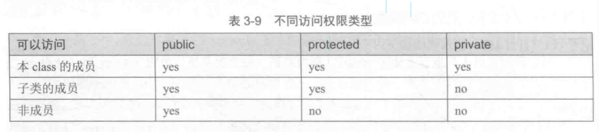

# 面向对象编程
## 类

类是一种将数据和函数组织在同一个结构里的逻辑方法。定义类的关键字为`class`。

其功能与C语言中的`struct`类似，不同的是`class`可以包含函数，类的定义为：
```C++
class class_name{
    private:
        // 私有成员，只有同一个class的其他成员或该class的"friend"class可以访问这些成员。
    public:
        // 公有成员 任何可以看到这个class的地方都可以访问这些成员
    protected:
        // 受保护成员 只有同一个class的其他成员或该class的"friend"class,或该class的子类可以访问这些成员。
}object_name;

class CRectangle{
        int x, y;
    public:
        void set_values(int,int);
        int area(void);
}rect;
```
注意class名称与对象(object)名称的不同，它们之间的关系就类似于：

`int a;`int是class名称，a是对象名(变量)


### 构造函数和析构函数

对象在生成过程中通常需要初始化变量或分配动态内存，以便我们能够操作，或防止在执行过程中返回以外结果。

一个class可以包含一个特殊函数：构造函数(constructor)，它可以通过声明一个与`class`同名的函数来定义。

当且仅当要生成一个class的新实例的时候，当且仅当声明一个新对象，或给改class的一个对象分配内存时，这个构造函数将被自动调用。


构造函数的原型和实现中都没有返回值，也没有`void`类型的声明。构造函数必须这么写，一个构造函数永远没有返回值，也不用声明`void`。

析构函数(destructor)的功能完全相反。它在对象从内存中释放时就被自动调用。释放可能是因为他存在的范围已经结束了；或是因为它是一个动态分配的对象，在使用操作符的时候就被释放了。

析构函数必须与`class`同名，加`~`前缀，必须也是无返回值。

析构函数特别适用于当一个对象被动态分配内存空间，而在对象被销毁时，我们希望释放它所占用的空间时。


### 构造函数重载
一个构造函数也可以被多次重载为同样名字的函数，但有不同的参数类型和个数。


### 类的指针
类也是可以有指针的，要定义类的指针就需要认识到，类一旦被定义就成为了一种高效的数据方式，因此只需要用类的名字作为指针的名字就可以了。

```C++
CRectangle *prect;  //一个指向class CRectangle类型的对象的指针。
```


### 有关键字`struct`和`union`定义的类
类不仅可以用关键字`class`来定义，也可以用`struct`或`union`来定义。

在C/C++中，类和数据结构的概念太相似了，两者的唯一区别在于：
>由`class`定义的类所有成员的默认访问权限为`private`，而`struct`定义的类所有成员默认访问权限为`public`。除此之外，两个关键字的作用是相同的。

`union`的概念与`struct`和`class`定义的类不同，因为`union`在同一时间只能存储一个数据成员。但有`union`定义的类也可以有成员函数，`union`定义的类的访问权限默认为`public`。

### :sparkles:操作符重载   P176
C++实现了在类之间使用语言标准操作符，而不只是在基本数据类型之间使用，


### :fire:关键字this
关键字this通常被用在一个`class`内部，指正在被执行的该`class`的对象在内存中的地址。

他是一个指针，其指永远是自身对象的地址。

关键字`this`可以被用来检查传入一个对象的成员函数的参数是不是该对象本身。


还经常被用在成员函数`operator=`中，用来返回对象的指针。


### 静态成员

一个`class`可以包含静态成员(static members)，可以是数据，也可以是函数。

一个`class`的静态数据成员也被称作类变量(class variables),因为它们的内容不依赖于某个对象，同一个`class`的所有`object`具有相同的值。


### 类之间的关系


#### 友元类

可以定义`class`是另一个类的`friend`,以便允许第二个`class`访问第一个`class`的`protected`和`private`成员。


#### 类之间的继承

类的集成，使得我们可以基于一个类生成另一个类的对象，以便使后者拥有前者的某些成员，再加上自己的一些成员。

定义一个类的子类，必须在子类的声明中使用冒号操作符`:`
`class [子类名称]：public [基类名称]；`





### 基类的继承
子类(drived class)继承了基类(base class)的所有成员，除了构造函数和析构函数。

虽然基类的构造函数和析构函数没有被继承，但是当子类的`object`被生成或销毁时，其基类的默认构造函数和析构函数总是被默认调用的。

如果基类没有默认构造函数，或希望当子类生成新的`object`时，基类的某个重载的构造函数被调用，就需要在子类的每一个构造函数的定义中指定它：
```C++
derived_class_name (parameter) : base_class_name (parameter) {函数体}
```


### 多重继承


在C++中，一个`class`可以从多个`class`中继承属性或函数，只需要在子类的额声明中用逗号将不同基类分开就可以了。例如：

```C++
class CRectangle: public CPolygon, public Coutput{
class CTriangle: public CPolygon, public COutput{

```
### 多态

#### 基类的指针

继承的好处之一就是：一个指向子类(drived class)的指针与一个指向基类(base class)的指针是类型兼容的。


#### 虚拟成员 P191

#### 抽象基类


