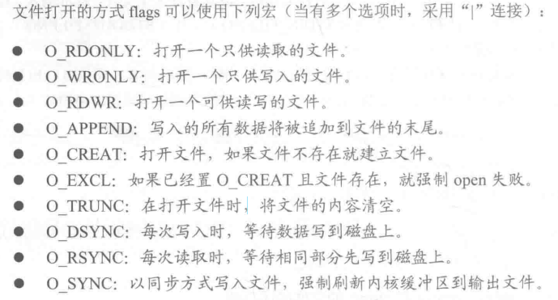
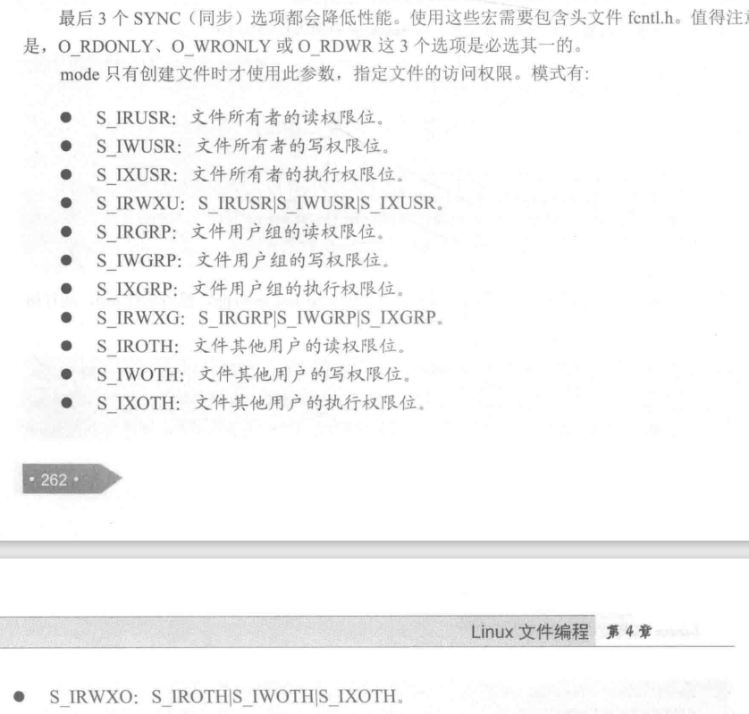
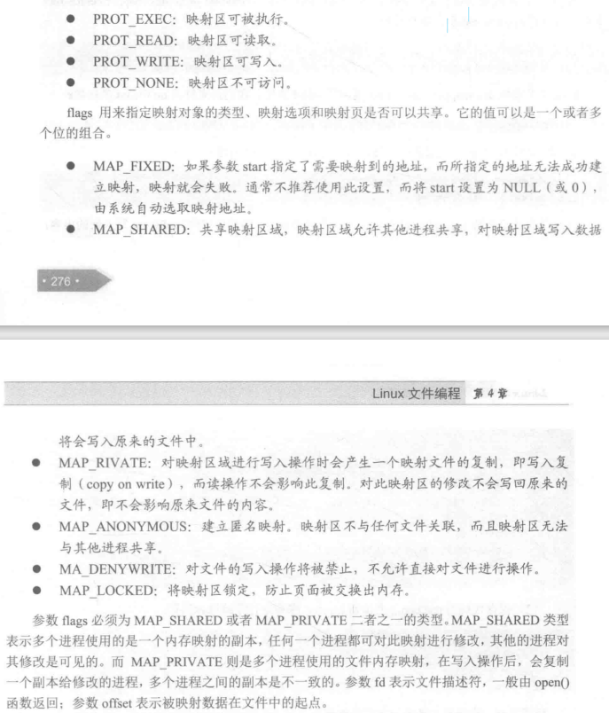

# 文件描述符
 
 对于Linux而言，所有对设备或文件的操作都是通过文件描述符进行的。

 当打开或者创建一个文件时，内核向进程返回一个文件描述符。后期对文件的操作只需通过该文件描述符，内核记录有关这个打开文件的信息。

 文件描述符与文件指针之间的转换：
 >函数`fileno`文件指针转换为文件描述符
 ```C++
int fileno(FILE *stream);   //stream是文件指针
 ```

 >函数`fdopen`将文件描述符转换为文件指针

 ```C++
FILE *fdopen(int fd, const char *mode);
 ```


## 打开或创建文件

Linux提供`open`函数来打开或者创建一个文件，该函数的声明：

```C++
#include <fcntl.h>
//函数执行成功返回fileno，否则返回-1
int open(const char *pathname, int flags);  //flags表示文件打开方式；
int open(const char *pathname,int flags,mode_t mode);   //mode用来规定对该文件的所有者、文件的用户组及系统中其他用户的访问权限
```






## 创建文件

Linux提供了一个专门创建文件的系统调用：
`int create(const char *pathname, mode_t mode);`    //  mode的取值同open函数

## 关闭文件

文件不再使用时，需要把他关闭，可以用`close`关闭文件。该函数的声明：
```C++
#include <unistd.h>
int close(int fd);
```
关闭之后，此文件描述符将不再指向任何文件，从而文件描述符可以再次使用。

## 读取文件中的数据

可以用函数`read`从已打开的文件中读取数据，该函数声明如下：
```C++
#include <unistd.h>
//返回值为实际读取到的字节数
ssize_t read(int fd, void *buf, size_t count);  //buf是指针所指的内存位置，count是字节数
```

### 向文件写入数据

可以使用函数`write`将数据写入已打开的文件内，函数声明为：
```C++
#include <unistd.h>
ssize_t write(int fd, const void *buf,size_t count);
```

该函数会把参数`buf`所指的缓冲区中的`count`个字节数据写入`fd`所指的文件内。当然，文件读写位置也会随之移动。

### 设定该文件偏移量

移动到需要读取文件的位置。文件偏移量指的是当前文件操作位置相对于文件开始位置的偏移。

用来设定文件偏移量的系统函数是`lseed`，该函数声明如下：

```C++
#include <unistd.h>
off_t lseek(int fd,off_t offset, int whence);   //whence是操作模式，offset是偏移量大小
```


### 获取文件状态

在设计程序时，我们通常要用到文件的特征值(文件的所有者，文件的修改时间，文件的大小)。`stat()`、`fstat()`、`lstat()`。
```C++
int stat(const char *path,struct stat *buf);
int fstat(int filedes, struct stat *buf);
int lstat(const char *path, struct stat *buf);
```


### 文件锁定 P272


### 建立文件和内存映射

所谓文件和内存映射，就是将普通文件映射到内存中，普通文件被映射到进程地址空间后，进程就可以向访问普通内存一样对文件进行访问了，不必再调用`read`和`write`等操作。系统提供了`mmap`将普通文件映射到内存中，该函数声明如下：
```C++
void *mmap(void *start, size_t length, int prot, int flags, int fd, off_t offset);  //参数start是映射区的起始地址，通常为NULL；Length表示映射数据的长度，即文件需要映射到内存中的数据的大小；prot表示映射区保护方式
```



`mmap()`映射后，让用户程序直接访问设备内存，相比较在用户空间和内核空间互相复制数据，效率更高。


