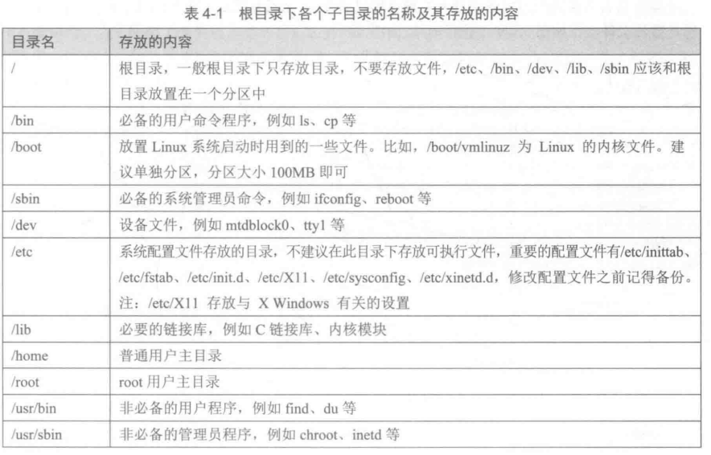
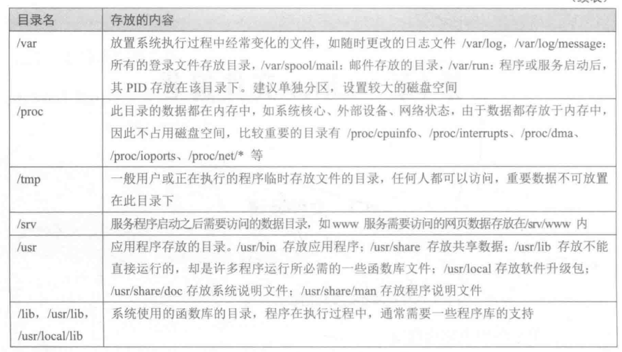

# 第四章 Linux文件编程

## 4.1 文件系统

文件系统是操作系统中负责管理和存储文件的软件系统。
FHS(File system Hierarchy Standard)

查看文件对应的i节点号(`stat`命令也可以)
`ls -i filename`

## 4.4 文件类型

Linux中一切皆文件。

在Linux中有7种文件类型：
- \- 普通文件
- d 目录
- b 块设备文件(block device)(具有一定结构的随机存取设备)
- c 字符设备文件(character device)(打印机、计算机显示器。。。)
- l 链接文件
- p 管道文件
- s 套接口文件(例如启动一个MySQL服务器时会产生一个mysql.sock文件)

### 4.3 块设备文件

是具有一定结构的随机存取设备