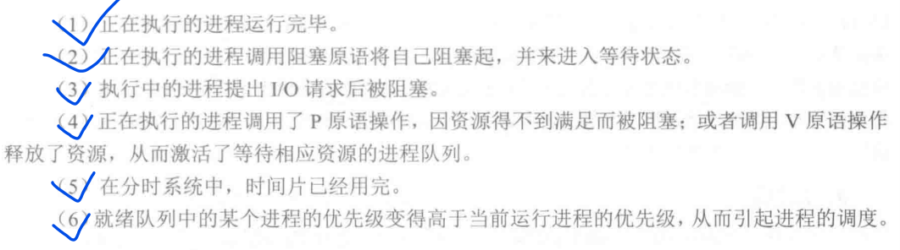

# 进程调度

进程调度的功能主要包括：
- 记录系统中所有进程的执行状况。
- 根据一定的调度算法，从就绪队列中选出一个进程来准备把处理机分配给他
- 将处理机分配给进程，进行上下文切换，把选中进程的进程控制块内有关的现场信息送入处理器的相应寄存器中。

## 进程的调度一般发生在：

## 常见的进程调度算法
- 先来先服务法(FCFS)
- 时间片轮转法(RR)
- 优先级算法
- 多级反馈队列法

Linux采用的是基于优先级可抢占式调度系统，并使用`schedule`函数实现进程调度的功能。

### :four_leaf_clover:优先级

实际上，Linux采用了两种优先级：静态优先级和动态优先级