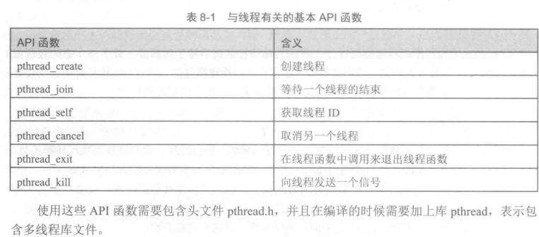
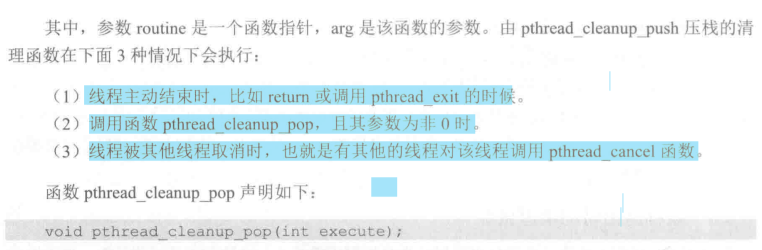

# 常见的POSIX多线程API函数


## 线程的创建

### `pthread_create()`
在POSIX API中，创建线程的函数是`pthread_create`，声明如下：
```C++
int pthread_create(pthread_t *pid, const pthread_attr_t *attr, void *(*start_routine)(void *), void *arg);
```

### `pthread_join()`

```C++
int pthread_join(pthread_t pid, void ** value_ptr);
```


## 线程的属性
POSIX标准规定线程具有多个属性：
- 分离状态(detached stated)
- 调度策略和参数(scheduling policy and parameters)
- 作用域(scope)
- 栈尺寸(stack size)
- 栈地址(stack address)
- 优先级(priority)

Linux为线程属性定义隔离一个联合体`pthread_attr_t`

如果要获取线程的属性
- 首先要用函数`pthread_getattr_np`，获取属性结构体值
- 再用相应的函数来具体获得某个属性值。
- 获得属性结构后，应该用函数`pthread_attr_destory`进行销毁。

其声明为：
```C++
int pthread_getattr_np(pthread_t thread, pthread_attr_t *attr);
int pthread_attr_destory(pthread_attr_t *attr);
```

如果要创建非默认属性的线程
- 可以在创建线程之前用函数`pthread_attr_init`来初始化一个线程属性结构体
- 再调用相应的API函数来设置相应的属性
- 接着把属性结构体的地址参作为数传入`pthread_create`.
`pthread_attr_init`声明如下：
```C++
int pthread_attr_init(pthread_attr_t *attr);
```

获取线程属性的方法：通过函数`pthread_getattr_np()`
```C++
int pthread_getattr_np(pthread_t thread, pthread_attr_t *attr);
```

### 分离状态

分离状态(detached state)是线程的一个很重要的属性，用来决定一个线程是以什么样的方式终止自己。(默认的分离状态是可连接的，默认属性下创建的线程是可连接线程)


#### 可分离的线程
这种线程运行结束时，其资源将立刻被系统回收，可以理解为这种线程能独立(分离出去)，可以自生自灭，父进程不会管。

将一个线程设置为可分离状态有两种方式：
- 调用函数`pthread_detach()`,将线程转换为可分离进程。
- 在创建进程时，就将它设置为可分离状态。(先`pthread_attr_init()`初始化一个线程属性的结构体变量,然后将其设置为可分离状态`pthread_attr_setdetachstate`,最后将该结构体变量的地址作为参数传入线程创建函数`pthread_create`).

```C++
int pthread_attr_setdetachstate(pthread_attr_t *attr, int detachtate);
```

### 可连接线程和可分离线程的区别
- 在任何一个时间点上，现成是可连接的(joinalbe)，或者是可分离的(detached),
- 一个可连接的线程在自己退出时或`pthread_exit`时，都不会释放现成所占用的堆栈和线程描述符，而是需要其他线程调用`pthread_join`之后，这些资源才会被释放。

- 一个可分离的线程是不能被其他线程回收或杀死的，它所占用的资源在终止时由系统自动释放。


### 栈尺寸

- 栈尺寸对于我们在线程函数中开设栈上的内存空间非常重要。
- 局部变量、函数参数、返回地址等都存放在栈空间内，而动态分配的内存(比如malloc())或全局变量等都属于堆空间。

获取线程栈尺寸属性的函数是`pthread_attr_getstacksize`,声明如下：
```C++
int pthread_attr_getstacksize(pthread_attr_t *attr, size_t *stacksize);
```


### 调度策略

进程中有了多个线程后，就要管理这些线程如何去占用CPU，这就是线程调度。

具体的调度策略可以分为：
- SCHED_OTHER(分时调度策略)
- SCHED_FIFO(先来先服务调度策略)
- SCHED_RR(实时调度策略，时间片轮转)


### 线程的结束

线程的结束通常有以下原因：
- 线程函数中调用了`pthread_exit()`函数。
- 线程所属的进程结束了，比如进程调用了`exit()`。
- 线程函数执行结束后返回(return)。
- 线程被同一进程中其他线程通知结束或取消了。


#### 线程主动结束
- 使用`return()`函数
- 调用`pthread_exit()`

#### 线程被动结束
- 在同进程的另一个线程中通过函数`pthread_kill`发送信号给要结束的线程。

其声明为:
```C++
int pthread_kill(pthread threadId, int signal);
```
- 在同进程的其他线程中通过函数`pthread_cancel`来取消目标线程的执行


## 线程退出时的清理机会

不论是可预见的线程终止还是异常终止，都会存在资源释放的问题。因此，如何保证线程终止时能顺利释放掉自己所占用的资源，特别是锁资源就非常重要。

POSIX线程库提供了函数`pthread_cleanup_push`和`pthread_cleanup_pop`，让线程退出时可以做一些清理工作。

>两个函数必须成对的出现在同一个函数中。否则编译不过

这两个函数采用先入后出的栈结构管理。前者会把一个函数压入清理函数栈，后者用来弹出栈顶的清理函数，并根据参数来决定是否执行清理函数。

多次调用函数`pthread_cleanup_push`将把当前在栈顶的清理函数往下压，弹出清理函数时，在栈顶的清理函数先被弹出。

声明如下：
```C++
void pthread_cleanup_push(void (*routine) (void *), void *arg);
void pthread_cleanup_pop(int execute);
```





