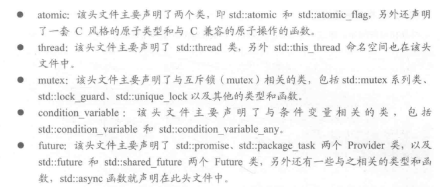
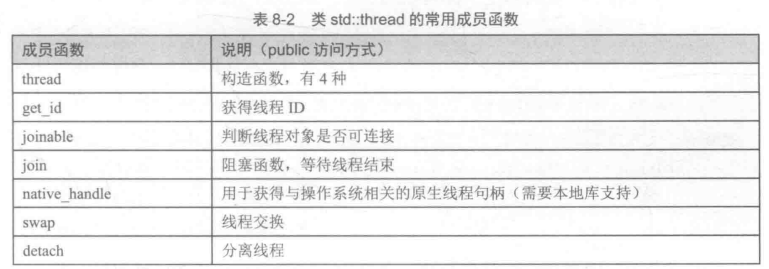

# C++中的线程类

C++11中引入了5个头文件来支持多线程编程：
- atomic
- thread
- mutex
- condition_variable
- future


std::thread类是非常重要的类，下面来概览以下这个类：


## 线程的创建

在C++11中，使用类`std::thread`的构造函数来创建线程，它的构造函数有三种方式：
- 不带参数的默认构造函数
- 初始化构造函数
- 移动构造函数


### 初始化构造函数

这种方式创建的线程是可连接线程，因此线程对象必须在销毁时调用`join`函数，或者是将其设置为可分离的。

#### 成员函数join
类`thread`提供了成员函数`join`来等待子线程结束，即子线程的线程函数执行完毕后，`join`才返回，因此`join`是一个阻塞函数。函数`join`会让主线程挂起(休眠,就是让出CPU)，直到子线程都退出，同时`join`能让子线程所占的资源得到释放。子线程退出后，主线程就会收到系统的信号，从休眠中恢复。

除了使用`join`函数来等待其结束并释放资源，还可以把可连接线程进行分离，即调用`detach`成员函数，变成可分离线程，线程自己结束后就可以被系统自动回收资源，而且主线程不需要等待子线程结束，主线程就可以自己先结束。`detach`的声明如下

```C++
void detach();
```


#### 移动(move)构造函数

通过向`thread`构造函数中传入一个C++对象来创建进程，这种形式的构造函数定义如下：
```C++

thread (thread&& x);
```


## 线程的标识符     P401

线程的标识符(ID)可以用来唯一标识某个`thread`对象所对应的线程，这样可以用来区别不同的线程。

类`thread`提供了成员函数`getid`来获取线程ID，声明如下：
```C++
thread::id get_id();
```

### 当前线程this_thread

C++11提供了一个命名空间`this_thread`来引用当前线程，该命名空间集合了4个常用的函数：
- `get_id`
- `yield`:调用该函数的线程将让出自己的CPU时间片，让其他线程运行。
- `sleep_until`
- `sleep_for`

#### 让线程暂停一段时间

`sleep_until`和`sleep_for`用来阻塞线程，暂停执行一段时间。


