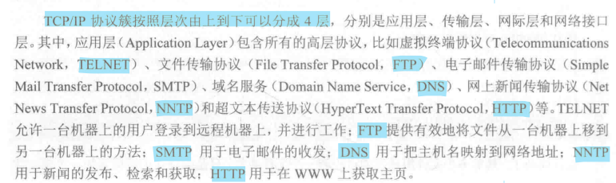

# TCP/IP协议

TCP/IP(Transmission Control Protocol/Internet Protocol)是传输控制协议/因特网互联协议，又名网络通信协议。

## TCP/IP协议的分层结构

TCP/IP协议簇按照层次有上到下可以分成4层：
- 应用层：包含所有的高层协议。

- 传输层：著名的TCP协议和UDP协议就在这层。
    - TCP协议是面向连接的协议，它提供可靠的报文传输和对上层应用的连接服务。除了数据传输外，它还有可靠性保证、流量控制、多路复用、优先权和安全性控制的功能。
    - UDP协议是面向无连接的不可靠传输的协议，主要用于不需要TCP的排序和流量控制等功能的应用程序。
- 网际层：该层是TCP/IP体系结构的关键部分，使主机可以把分组发往任何网络。
- 网络接口层(数据链路层)：该层是整个体系结构的基础，负责接受IP层的IP数据包，通过网络向外发送；或接受处理从网络上传来的物理帧。