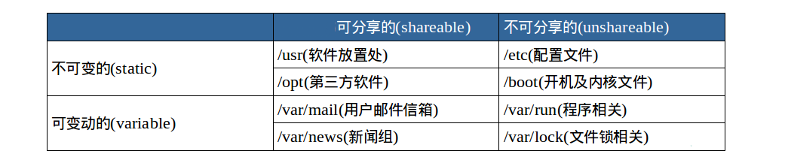

# 实验2 基本概念及操作
## 输出图形字符的命令
`banner`
# 实验3 用户及文件权限管理
## 查看用户
> 打开终端，输入
`who am i`


> 输出的第一列表示打开当前伪终端的用户的用户名（要查看当前登录用户的用户名，去掉空格直接使用 whoami 即可），第二列的 pts/0 中 pts 表示伪终端，所谓伪是相对于 /dev/tty 设备而言的，还记得上一节讲终端时的那七个使用 [Ctrl]+[Alt]+[F1]～[F7] 进行切换的 /dev/tty 设备么，这是“真终端”，伪终端就是当你在图形用户界面使用 /dev/tty7 时每打开一个终端就会产生一个伪终端，pts/0 后面那个数字就表示打开的伪终端序号，你可以尝试再打开一个终端，然后在里面输入 who am i，看第二列是不是就变成 pts/1 了，第三列则表示当前伪终端的启动时间。

### who命令的其他常用参数


## 创建用户
> root 权限，系统权限的一种，与 SYSTEM 权限可以理解成一个概念，但高于 Administrator 权限，root 是 Linux 和 UNIX 系统中的超级管理员用户帐户，该帐户拥有整个系统至高无上的权力，所有对象他都可以操作，所以很多黑客在入侵系统的时候，都要把权限提升到 root 权限，这个操作等同于在 Windows 下就是将新建的非法帐户添加到 Administrators 用户组。
### `su`、`su-`、`sudo`
> `su <user>`可以切换到用户 user，执行时需要输入目标用户的密码。
>
>`sudo <cmd>`可以以特权级别运行 cmd 命令，需要当前用户属于 sudo 组，且需要输入当前用户的密码。
>
> `su - <user>`命令也是切换用户，但是同时用户的环境变量和工作目录也会跟着改变成目标用户所对应的。

### 新建一个叫djw1的用户
`sudo adduser djw1`

>这个命令不但可以添加用户到系统，同时也会默认为新用户在 /home 目录下创建一个工作目录：


### 切换用户
从普通用户切换到root
`su -`
从root切换到普通用户
`su -l 普通用户`

## 用户组
>在 Linux 里面每个用户都有一个归属（用户组），用户组简单地理解就是一组用户的集合，它们共享一些资源和权限，同时拥有私有资源，就跟家的形式差不多，你的兄弟姐妹（不同的用户）属于同一个家（用户组），你们可以共同拥有这个家（共享资源），爸妈对待你们都一样（共享权限），你偶尔写写日记，其他人未经允许不能查看（私有资源和权限）。当然一个用户是可以属于多个用户组的，正如你既属于家庭，又属于学校或公司。

### 如何知道自己属于哪个用户组？
#### 使用`groups命令`
`groups djw`

### 将其他用户加入`sudo`用户组
> 默认情况下 新创建用户不具有root权限，也不在sudo用户组，可以让其加入sudo用户组从而获得root权限。
```shell
# 创建一个新用户
$ su -l djw1
$ sudo ls
$ sudo usermod -G sudo djw1
$ groups djw1
```

## 删除用户和用户组
> 删除用户是很简单的事：
`sudo deluser djw1 --remove-home`

> 使用`--remove-home`参数在删除用户时会一并将该用户的工作目录一并删除。


## Linux文件权限
> 文件权限就是文件的访问控制权限，即哪些用户和组群可以访问文件以及可以执行什么样的操作。
>
> Unix/Linux 系统是一个典型的多用户系统，不同的用户处于不同的地位，对文件和目录有不同的访问权限。为了保护系统的安全性，Unix/Linux 系统除了对用户权限作了严格的界定外，还在用户身份认证、访问控制、传输安全、文件读写权限等方面作了周密的控制。
>
>在 Unix/Linux 中的每一个文件或目录都包含有访问权限，这些访问权限决定了谁能访问和如何访问这些文件和目录。

### 查看文件权限


> 关于文件类型，这里有一点你必需时刻牢记 Linux 里面一切皆文件，正因为这一点才有了设备文件（ /dev 目录下有各种设备文件，大都跟具体的硬件设备相关）这一说。 
>
>socket：网络套接字，具体是什么，感兴趣的用户可以去学习实验楼的后续相关课程。
>
>pipe 管道，这个东西很重要，我们以后将会讨论到，这里你先知道有它的存在即可。
>
>软链接文件：链接文件是分为两种的，另一种当然是“硬链接”（硬链接不常用，具体内容不作为本课程讨论重点，而软链接等同于 Windows 上的快捷方式，你记住这一点就够了）。

>读写权限
>
>执行权限，通常指可以运行的二进制程序文件或者脚本文件，如同 Windows 上的 exe 后缀的文件，不过 Linux 上不是通过文件后缀名来区分文件的类型。你需要注意的一点是，一个目录同时具有读权限和执行权限才可以打开并查看内部文件，而一个目录要有写权限才允许在其中创建其它文件，这是因为目录文件实际保存着该目录里面的文件的列表等信息。

### `ls`命令
- 显示所有文件大小，并以普通人类能看懂的方式呈现：

`ls -asSh`

其中小 s 为显示文件大小，大 S 为按文件大小排序，若需要知道如何按其它方式排序，可以使用 man ls 命令查询。
- 以长格式列出
`ls -l`

### 变更文件所有者
```shell
ls -alh
sudo chown shiyanlou iphone11
```


### 修改文件权限
> 如果你有一个自己的文件不想被其他用户读、写、执行，那么就需要对文件的权限做修改。文件的权限有两种表示方式：
#### 二进制数字表示

> 每个文件有三组固定的权限，分别对应拥有者，所属用户组，其他用户，记住这个顺序是固定的。文件的读写执行对应字母 rwx，以二进制表示就是 111，用十进制表示就是 7，对进制转换不熟悉的同学可以看看 进制转换。
>
>例如我们刚刚新建的文件 iphone11 的权限是 rw-rw-rw-，换成对应的十进制表示就是 666，这就表示这个文件的拥有者，所属用户组和其他用户具有读写权限，不具有执行权限。

#### 加减赋值操作
还可以
`chmod go-rw iphone`
> g、o 还有 u 分别表示 group（用户组）、others（其他用户） 和 user（用户），+ 和 - 分别表示增加和去掉相应的权限。

### `adduser`和`useradd`的区别是什么？
> `useradd`只创建用户，不会创建用户密码和工作目录，创建完了需要使用`passwd <username>`去设置新用户的密码。
>
> `adduser` 在创建用户的同时，会创建工作目录和密码（提示你设置），做这一系列的操作。
>
>其实 `useradd`、`userdel` 这类操作更像是一种命令，执行完了就返回。而 `adduser` 更像是一种程序，需要你输入、确定等一系列操作。

## :pushpin: 实验四：Linux目录结构及文件基本操作
- Linux的文件组织目录结构
- 相对路径和绝对路径
- 对文件的移动、复制、重命名、编辑等操作。
- `touch`,`file`,`rm`,`mv`等基本命令。

### :closed_book: Linux目录结构
> 在讲 Linux 目录结构之前，你首先要清楚一点，那就是 Linux 的目录与 Windows 的目录的区别，或许对于一般操作上的感受来说没有多大不同，但从它们的实现机制来说是完全不同的。
>
> 一种不同是体现在目录与存储介质（磁盘，内存，DVD 等）的关系上，以往的 Windows 一直是以存储介质为主的，主要以盘符（C 盘，D 盘...）及分区来实现文件管理，然后之下才是目录，目录就显得不是那么重要，除系统文件之外的用户文件放在任何地方任何目录也是没有多大关系。所以通常 Windows 在使用一段时间后，磁盘上面的文件目录会显得杂乱无章（少数善于整理的用户除外吧）。然而 UNIX/Linux 恰好相反，UNIX 是以目录为主的，Linux 也继承了这一优良特性。 Linux 是以树形目录结构的形式来构建整个系统的，可以理解为树形目录是一个用户可操作系统的骨架。虽然本质上无论是目录结构还是操作系统内核都是存储在磁盘上的，但从逻辑上来说 Linux 的磁盘是“挂在”（挂载在）目录上的，每一个目录不仅能使用本地磁盘分区的文件系统，也可以使用网络上的文件系统。举例来说，可以利用网络文件系统（Network File System，NFS）服务器载入某特定目录等。

### :blue_book: FHS标准
> Linux 的目录结构说复杂很复杂，说简单也很简单。复杂在于，因为系统的正常运行是以目录结构为基础的，对于初学者来说里面大部分目录都不知道其作用，重要与否，特别对于那些曾经的重度 Windows 用户，他们会纠结很长时间，关于我安装的软件在哪里这类问题。说它简单是因为，其中大部分目录结构是规定好了的（FHS 标准），是死的，当你掌握后，你在里面的一切操作都会变得井然有序。
>
>FHS（英文：Filesystem Hierarchy Standard 中文：文件系统层次结构标准），多数 Linux 版本采用这种文件组织形式，FHS 定义了系统中每个区域的用途、所需要的最小构成的文件和目录同时还给出了例外处理与矛盾处理。

FHS 定义了两层规范，第一层是， `/` 下面的各个目录应该要放什么文件数据，例如 `/etc` 应该放置设置文件，`/bin` 与 `/sbin` 则应该放置可执行文件等等。

第二层则是针对 `/usr` 及 `/var` 这两个目录的子目录来定义。例如 `/var/log` 放置系统日志文件，`/usr/share` 放置共享数据等等。


关于上面提到的 FHS，这里还有个很重要的内容你一定要明白，FHS 是根据以往无数 Linux 用户和开发者的经验总结出来的，并且会维持更新，FHS 依据文件系统使用的频繁与否以及是否允许用户随意改动（注意，不是不能，学习过程中，不要怕这些），将目录定义为四种交互作用的形态，如下表所示：



### :blue_book: 移动文件与文件重命名
`mv`
mv除了能移动文件外，还能给文件重命名。命令格式为`mv 旧filename 新filename`
#### :orange_book: 批量重命名
>更专业的命令 rename 来实现。不过它要用 perl 正则表达式来作为参数，关于正则表达式我们要在后面才会介绍到，这里只做演示，你只要记得这个 rename 命令可以批量重命名就好了，以后再重新学习也不会有任何问题，毕竟你已经掌握了一个更常用的 mv 命令。

**rename 命令并不是内置命令，若提示无该命令可以使用 sudo apt-get install rename 命令自行安装。**
```shell
#使用通配符批量创建5个文件
touch file{1..5}.txt
#批量将这5个后缀为.txt的文本文件重命名为.c为后缀的文件
rename 's/\.txt/\.c' *.txt

#批量将这5个文件的文件名和后缀改为大写
rename 'y/a-z/A-Z/' *.C
```

### :blue_book: 查看文件
使用`cat`、`tac`和`nl`命令查看文件

前两个命令都是用来打印文件内容到标准输出（终端），其中 `cat` 为正序显示，`tac` 为倒序显示。

>标准输入输出：当我们执行一个 shell 命令行时通常会自动打开三个标准文件，即标准输入文件（stdin），默认对应终端的键盘、标准输出文件（stdout）和标准错误输出文件（stderr），后两个文件都对应被重定向到终端的屏幕，以便我们能直接看到输出内容。进程将从标准输入文件中得到输入数据，将正常输出数据输出到标准输出文件，而将错误信息送到标准错误文件中。

:orange_book: `cat`加上`-n`参数显示行号：

:orange_book: `nl`命令，添加行号并打印，这是个比`cat -n`更专业的行号打印命令。
这里简单列举几个常用参数：

-b : 指定添加行号的方式，主要有两种：

    -b a:表示无论是否为空行，同样列出行号("cat -n"就是这种方式)
    -b t:只列出非空行的编号并列出（默认为这种方式）
-n : 设置行号的样式，主要有三种：

    -n ln:在行号字段最左端显示
    -n rn:在行号字段最右边显示，且不加 0
    -n rz:在行号字段最右边显示，且加 0
-w : 行号字段占用的位数(默认为 6 位)
***

:orange_book: 使用`more`和`less`命令分页查看文件

>如果说上面的 cat 是用来快速查看一个文件的内容的，那么这个 more 和 less 就是天生用来"阅读"一个文件的内容的，比如说 man 手册内部就是使用的 less 来显示内容。其中 more 命令比较简单，只能向一个方向滚动，而 less 为基于 more 和 vi （一个强大的编辑器，我们有单独的课程来让你学习）开发，功能更强大。less 的使用基本和 more 一致，具体使用请查看 man 手册，这里只介绍 more 命令的使用。
`more file`
打开后默认只显示一屏内容，终端底部显示当前阅读的进度。可以使用 `Enter` 键向下滚动一行，使用 `Space` 键向下滚动一屏，按下 `h` 显示帮助，`q` 退出。

:orange_book: 使用`head`和`tail`命令分页查看文件
> 这两个命令，那些性子比较急的人应该会喜欢，因为它们一个是只查看文件的头几行（默认为 10 行，不足 10 行则显示全部）和尾几行。还是拿 passwd 文件举例，比如当我们想要查看最近新增加的用户，那么我们可以查看这个 /etc/passwd 文件，不过我们前面也看到了，这个文件里面一大堆乱糟糟的东西，看起来实在费神啊。因为系统新增加一个用户，会将用户的信息添加到 passwd 文件的最后，那么这时候我们就可以使用 `tail` 命令了：

甚至更直接的只看一行， 加上 `-n` 参数，后面紧跟行数：
`tail -n 1 /etc/passwd`
关于 tail 命令，不得不提的还有它一个很牛的参数 -f，这个参数可以实现不停地读取某个文件的内容并显示。这可以让我们动态查看日志，达到实时监视的目的。不过我不会在这门基础课程中介绍它的更多细节，感兴趣的用户可以自己去了解。

### :blue_book: 查看文件类型
我们可以使用`file`命令查看文件的类型
`file xx`

### :blue_book: 编辑文件
# vim

## :pushpin: 实验五：环境命令与文件查找
本节实验介绍环境变量的作用与用法，及几种搜索文件的方法。学会这些技巧可以高效地使用 Linux 。
### 实验知识点
- 环境变量的设置
- 环境变量的修改

### :closed_book: 环境变量
要解释环境变量，得先明白变量是什么，准确的说应该是 Shell 变量，所谓变量就是计算机中用于记录一个值（不一定是数值，也可以是字符或字符串）的符号，而这些符号将用于不同的运算处理中。通常变量与值是一对一的关系，可以通过表达式读取它的值并赋值给其它变量，也可以直接指定数值赋值给任意变量。

为了便于运算和处理，大部分的编程语言会区分变量的类型，用于分别记录数值、字符或者字符串等等数据类型。Shell 中的变量也基本如此，有不同类型（但不用专门指定类型名），可以参与运算，有作用域限定。

> [高级bash脚本编程指南](https://www.lanqiao.cn/courses/944)

使用`declare tmp`命令创建一个变量名为tmp的变量
`declare tmp`

使用`=`复制运算符，将变量tmp复制为djw。(Note:`=`两端不能有空格)
`tmp=djw`
读取变量的值，使用`echo`命令和`$`符号。
`echo $tmp`

简单理解了变量的概念，就很容易理解环境变量了。环境变量的作用域比自定义变量的要大，如 Shell 的环境变量作用于自身和它的子进程。在所有的 UNIX 和类 UNIX 系统中，每个进程都有其各自的环境变量设置，且默认情况下，当一个进程被创建时，除了创建过程中明确指定的话，它将继承其父进程的绝大部分环境设置。Shell 程序也作为一个进程运行在操作系统之上，而我们在 Shell 中运行的大部分命令都将以 Shell 的子进程的方式运行。


通常我们会涉及到的变量类型有三种：
- 当前 Shell 进程私有用户自定义变量，如上面我们创建的 tmp 变量，只在当前 Shell 中有效。
- Shell 本身内建的变量。
- 从自定义变量导出的环境变量。
也有三个与上述三种环境变量相关的命令：`set`，`env`，`export`。这三个命令很相似，都是用于打印环境变量信息，区别在于涉及的变量范围不同。详见下表：
    - `set`:显示当前 Shell 所有变量，包括其内建环境变量（与 Shell 外观等相关），用户自定义变量及导出的环境变量。
    - `env`:显示与当前用户相关的环境变量，还可以让命令在指定环境中运行。
    - `export`:显示从 Shell 中导出成环境变量的变量，也能通过它将自定义变量导出为环境变量。


#### 永久生效
当你关机后，或者关闭当前的 shell 之后，环境变量就没了啊。怎么才能让环境变量永久生效呢？

按变量的生存周期来划分，Linux 变量可分为两类：
1.永久的：需要修改配置文件，变量永久生效；
2.临时的：使用 export 命令行声明即可，变量在关闭 shell 时失效。

两个重要文件`/etc/bashrc`和`/etc/profile`,分别存放的是shell变量和环境变量。


> 这个`.profile` 只对当前用户永久生效。因为它保存在当前用户的 Home 目录下，当切换用户时，工作目录可能一并被切换到对应的目录中，这个文件就无法生效。
>
>而写在 `/etc/profile` 里面的是对所有用户永久生效，所以如果想要添加一个永久生效的环境变量，只需要打开 `/etc/profile`，在最后加上你想添加的环境变量就好啦。


### :blue_book: 修改和删除已有变量
变量修改有以下几种方式：
- `${变量名#匹配字串}`     从头向后开始匹配，删除符合匹配字串的最短数据
- `${变量名##匹配字串}`    从头向后开始匹配，删除符合匹配字串的最长数据
- `${变量名%匹配字串}` 	   从尾向前开始匹配，删除符合匹配字串的最短数据
- `${变量名%%匹配字串}`    从尾向前开始匹配，删除符合匹配字串的最长数据
- `${变量名/旧的字串/新的字串}` 	将符合旧字串的第一个字串替换为新的字串
- `${变量名//旧的字串/新的字串}` 	将符合旧字串的全部字串替换为新的字串

### :blue_book: 如何让环境变量立即生效
可以使用`source`命令来让其立即生效
`source .bashrc`

`source`命令还有一个别名就是`.`,所以也可以替换成：
`. ./.bashrc`

### :blue_book: 搜索文件
与搜索相关的命令常用的有`whereis`,`which`,`find`和`locate`.

#### :bookmark: `whereis`简单快速
`whereis`只能搜索二进制文件(`-b`),man帮助文件(`-m`)和源代码文件(`-s`)

#### :bookmark: `locate`快而全
使用 locate 命令查找文件也不会遍历硬盘，它通过查询 /var/lib/mlocate/mlocate.db 数据库来检索信息。不过这个数据库也不是实时更新的，系统会使用定时任务每天自动执行 updatedb 命令来更新数据库。所以有时候你刚添加的文件，它可能会找不到，需要手动执行一次 updatedb 命令（在我们的环境中必须先执行一次该命令）。注意这个命令也不是内置的命令，在部分环境中需要手动安装，然后执行更新。
```shell
sudo apt-get update
sudo apt-get install locate
sudo updatedb
```
它可以用来查找指定目录下的不同文件类型，如查找 `/etc `下所有以 `sh` 开头的文件：
`locate /etc/sh`
查找`/usr/share`下所有jpg文件
`locate /usr/share/*.jpg`

#### :bookmark: `which`小而精
`which`本身是 `Shell` 内建的一个命令，我们通常使用 `which` 来确定是否安装了某个指定的程序，因为它只从 `PATH` 环境变量指定的路径中去搜索命令并且返回第一个搜索到的结果。也就是说，我们可以看到某个系统命令是否存在以及执行的到底是哪一个地方的命令。
```shell
which man
which nginx
which ping
```
#### :bookmark: `find`精而细
`find` 应该是这几个命令中最强大的了，它不但可以通过文件类型、文件名进行查找而且可以根据文件的属性（如文件的时间戳，文件的权限等）进行搜索。

>Note： find 命令的路径是作为第一个参数的， 基本命令格式为 find [path][option] [action] 。

`sudo find /etc/ -name interfaces`
这条命令表示去 `/etc/` 目录下面 ，搜索名字叫做 `interfaces` 的文件或者目录。这是 `find` 命令最常见的格式，千万记住 `find` 的第一个参数是要搜索的地方。命令前面加上 `sudo` 是因为 `shiyanlou` 只是普通用户，对 `/etc` 目录下的很多文件都没有访问的权限，如果是 `root` 用户则不用使用。

[具体细节](https://www.lanqiao.cn/courses/1/learning/?id=60&compatibility=true)

## :pushpin: 实验六：文件打包与解压缩
简洁版：
### :blue_book: zip
- 打包：zip something.zip something(整个目录的话加 -r )
- 解包：unzip something.zip
- 指定路径： -d

### :blue_book:tar
- 打包：tar -cf something.tar something
- 解包：tar -xf something.tar
- 指定路径：-C

***
***
## :pushpin: [实验七](https://www.lanqiao.cn/courses/1/learning/?id=62&compatibility=true)：文件系统操作与磁盘管理
# 未完待续~~~


